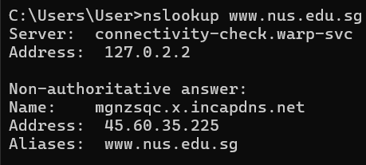
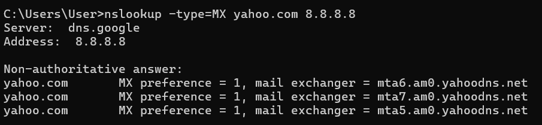
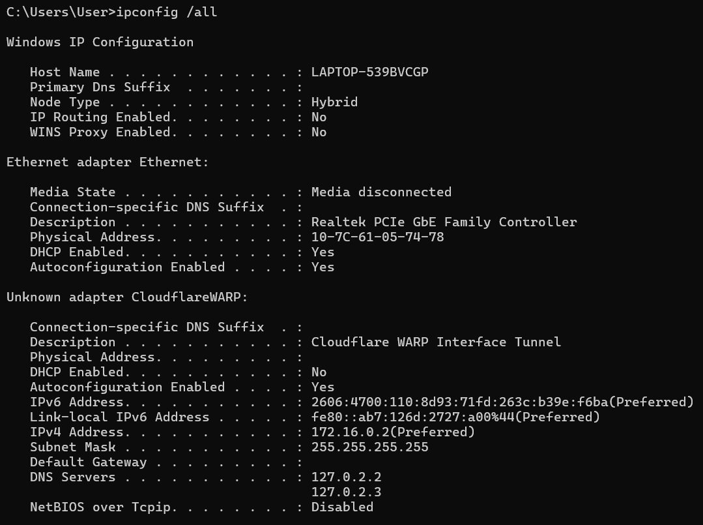
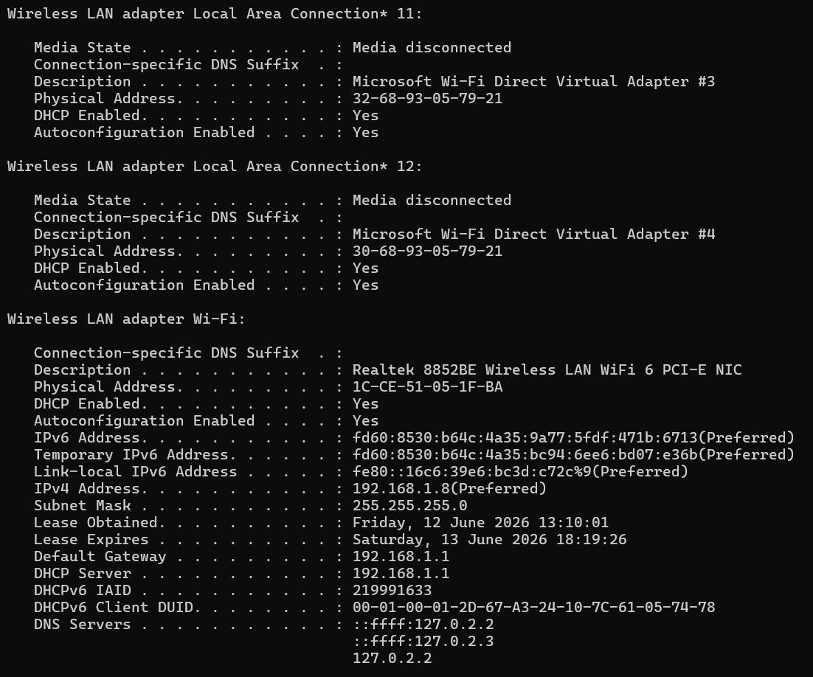
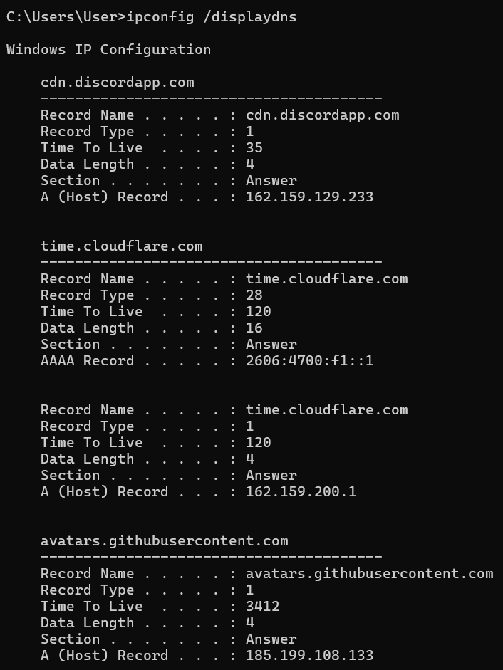
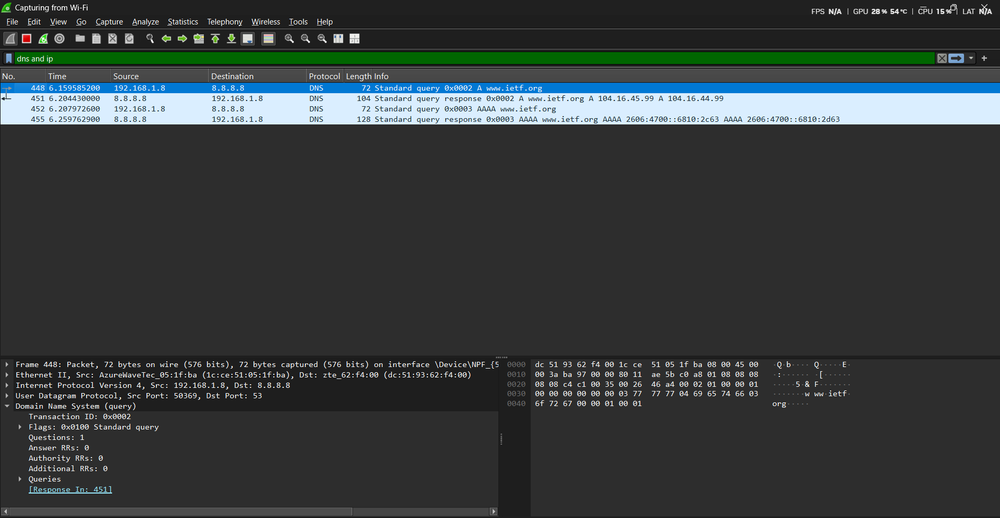
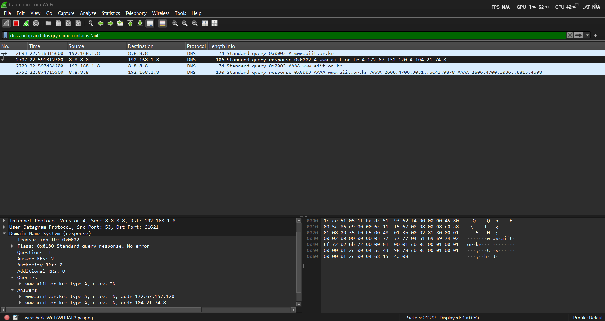

# Laporan Praktikum Jaringan Komputer: Domain Name System (DNS)

### Identitas Praktikan

| Keterangan | Imformasi |
| :--- | :--- |
| **Nama** | Alif Luthfan Adeefa |
| **NIM** | 103072400163 |
| **Kelas** | IF-04-01 |

---

## 1. Capaian Pembelajaran

| No | Tujuan | Penjelasan Sederhana |
| :---: | :--- | :--- |
| **1** | Memahami konsep DNS | Mengerti bagaimana nama website diubah jadi angka IP |
| **2** | Menggunakan `nslookup` | Bisa pakai perintah `nslookup` untuk cek DNS |
| **3** | Mengenal jenis record DNS | Tahu bedanya A, NS, MX, CNAME, dan fungsinya |
| **4** | Memahami hierarki DNS | Mengerti alur dari DNS lokal → root → TLD → server asli |
| **5** | Mengelola cache DNS | Bisa lihat dan hapus cache DNS pakai `ipconfig` |

## 2. Dasar Teori

### 2.1 Apa Itu DNS?

| Pertanyaan | Jawaban |
| :--- | :--- |
| **Kepanjangan** | Domain Name System |
| **Fungsi Utama** | Mengubah nama domain (contoh: `google.com`) jadi alamat IP (contoh: `142.250.185.46`) |
| **Analogi Sederhana** | Seperti buku telepon: cari nama → dapat nomor |
| **Tanpa DNS** | Kita harus hafal angka IP tiap website |

### 2.3 Jenis-Jenis Record DNS

| Jenis Record | Fungsi | Contoh Hasil |
| :---: | :--- | :--- |
| **A** | Domain → IPv4 | `google.com` → `142.250.185.46` |
| **AAAA** | Domain → IPv6 | `google.com` → `2404:6800:4001:800::200e` |
| **NS** | Menunjukkan server DNS resmi domain | `google.com` → `ns1.google.com` |
| **MX** | Menunjukkan server email domain | `yahoo.com` → `mta7.am0.yahoodns.net` |
| **CNAME** | Nama alias / redirect domain | `www.mit.edu` → `mit.edu.edgekey.net` |
| **PTR** | IP → Domain (kebalikan A record) | `142.250.185.46` → `google.com` |

## 3. Langkah Kerja

### Ringkasan Semua Percobaan

| No | Percobaan | Perintah / URL | Yang Diamati |
| :---: | :--- | :--- | :--- |
| **1** | Query A Record | `nslookup www.mit.edu` | IP dari domain |
| **2** | Query NS Record | `nslookup -type=NS www.mit.edu` | Server DNS resmi domain |
| **3** | Query ke DNS tertentu | `nslookup www.aiit.or.kr 8.8.8.8` | Beda hasil pakai DNS Google |
| **4** | Query domain Asia | `nslookup www.nus.edu.sg` | IP server di Singapura |
| **5** | Query NS domain Eropa | `nslookup -type=NS www.ox.ac.uk` | Name server University of Oxford |
| **6** | Query MX Record | `nslookup -type=MX yahoo.com 8.8.8.8` | Server email Yahoo |
| **7** | Cek konfigurasi jaringan | `ipconfig /all` | Info IP, DNS, gateway laptop |
| **8** | Lihat cache DNS | `ipconfig /displaydns` | Daftar domain yang pernah diakses |
| **9** | Analisis DNS via Wireshark tanpa nslookup | Akses `www.ietf.org` + capture | Paket DNS query & response |
| **10** | Analisis nslookup via Wireshark | `nslookup www.mit.edu` + capture | Detail paket DNS dari tool |

## 4.1 Query A Record (Domain → IP)

| Informasi               | Nilai                            |
|-------------------------|----------------------------------|
| Domain yang dicek       | `www.mit.edu`                    |
| Hasil IP                | `23.15.150.186`                  |
| DNS Server yang dipakai | DNS lokal (dari `ipconfig`)      |
| Status jawaban          | Non-authoritative (dari cache)   |

## 4.2 Query NS Record (Siapa Server Resminya?)

| Informasi    | Nilai                        |
|--------------|------------------------------|
| Domain       | `www.mit.edu`                |
| Jenis Query  | NS (Name Server)             |
| Hasil        | Daftar server DNS resmi MIT  |
| Contoh       | `dscb.akamaiedge.net`        |

## 4.3 Query ke DNS Server Tertentu

| Parameter               | Nilai                                      |
|-------------------------|--------------------------------------------|
| Domain                  | `www.aiit.or.kr`                           |
| DNS Server yang dipakai | `8.8.8.8` (Google Public DNS)              |
| Hasil IP                | `172.67.152.120` , `104.21.74.8`           |

## 4.4 Query Alamat IP Server Web di Asia

| Domain            | Lokasi        | Hasil IP       | Keterangan                        |
|-------------------|---------------|----------------|-----------------------------------|
| `www.nus.edu.sg`  | Singapura, SG | `45.60.35.225` | National University of Singapore |

**Analisis:**

- Perintah `nslookup www.nus.edu.sg` digunakan untuk mengetahui alamat IP dari domain tersebut.

- Domain www.nus.edu.sg merupakan server web milik National University of Singapore (NUS) di Asia.

- Hasil query menampilkan satu atau lebih alamat IP yang terasosiasi dengan domain tersebut.

- Alamat IP inilah yang digunakan oleh client untuk mengakses server web tujuan.

- Query ini menunjukkan proses dasar resolusi DNS dari nama domain menjadi alamat IP.

## 4.5 Query DNS Otoritatif (NS Record)

**Analisis:**

- Perintah nslookup -type=NS www.ox.ac.uk digunakan untuk mengetahui server DNS otoritatif dari domain tersebut.

- Hasil query menampilkan daftar Name Server (NS) yang bertanggung jawab atas domain www.ox.ac.uk.

- Server DNS otoritatif adalah server yang memiliki informasi resmi terkait domain tersebut.

- Informasi ini penting untuk memahami bagaimana DNS mendistribusikan tanggung jawab pengelolaan domain.

- Domain tersebut merupakan milik University of Oxford di Eropa.

## 4.6 Query MX Record (Server Email)

| Mail Server              | Fungsi              |
|--------------------------|---------------------|
| `mta7.am0.yahoodns.net`  | Prioritas tertinggi |
| `mta6.am0.yahoodns.net`  | Cadangan            |
| `mta5.am0.yahoodns.net`  | Cadangan lagi       |

**Penjelasan Priority:**

- Angka kecil = prioritas lebih tinggi
- Email dikirim ke server priority 1 dulu
- Kalau gagal, coba priority 5, lalu 10, dst.

## 4.7 Perintah ipconfig (Cek & Kelola Jaringan)

## 4.7.1 ipconfig /all — Lihat Semua Info Jaringan

| Informasi        | Contoh Nilai                    | Kegunaan                              |
|------------------|---------------------------------|---------------------------------------|
| IPv4 Address     | `192.168.1.8`                   | Alamat laptop di jaringan lokal       |
| Subnet Mask      | `255.255.255.0`                 | Menentukan rentang jaringan           |
| Default Gateway  | `192.168.1.1`                   | Alamat router / modem                 |
| DNS Servers      | `127.0.2.2` , `127.0.2.3`      | Server yang dipakai untuk resolusi DNS |
| Physical Address | `1C-CE-51-05-1F-BA`             | MAC Address adapter jaringan          |

## 4.7.2 ipconfig /displaydns — Lihat Cache DNS

| Field        | Arti                                              |
|--------------|---------------------------------------------------|
| Record Name  | Nama domain yang di-cache                         |
| Record Type  | Jenis record (A, AAAA, CNAME, dll)                |
| Time To Live | Berapa detik lagi cache ini kadaluarsa            |
| Data Length  | Ukuran data record                                |
| Section      | Bagian pesan DNS (Answer, Authority, Additional)  |

## 4.8 Analisis DNS via Wireshark + nslookup

#### 4.8.1 Pertanyaan dan Analisis

**1. Apakah protokol transport yang digunakan DNS?**

DNS menggunakan protokol **UDP (User Datagram Protocol)** dengan port tujuan **53**. Hal ini terlihat pada panel detail Wireshark:

UDP dipilih karena lebih ringan dan cepat untuk query kecil seperti DNS, tanpa perlu proses handshake seperti TCP.

---

**2. Berapa port sumber dan port tujuan yang digunakan?**

| Keterangan   | Nilai  |
| ------------ | ------ |
| Port Sumber  | 50369  |
| Port Tujuan  | 53     |

Port sumber bersifat **ephemeral** (acak), sedangkan port tujuan selalu **53** sesuai standar DNS.

---

**3. Ke IP mana DNS Query dikirimkan? Apakah sama dengan DNS server pada `ipconfig`?**

DNS Query dikirimkan ke **`8.8.8.8`** (Google Public DNS). Hal ini dikarenakan pada perintah `nslookup` ditambahkan argumen `8.8.8.8` untuk memaksa query langsung ke Google DNS, bukan ke DNS lokal router (`192.168.1.1`).

---

**4. Apa saja jenis query DNS yang dikirimkan?**

Terdapat 2 jenis query yang dikirimkan:

| No | Jenis Query | Keterangan                  |
| -- | ----------- | --------------------------- |
| 1  | **A**       | Menanyakan alamat IPv4      |
| 2  | **AAAA**    | Menanyakan alamat IPv6      |

---

**5. Apakah DNS Query mengandung jawaban?**

**Tidak.** Paket DNS Query hanya berisi pertanyaan, tanpa jawaban. Hal ini terlihat dari:

---

**6. Apa isi jawaban dari DNS Response?**

DNS server `8.8.8.8` memberikan respons sebagai berikut:

| Record | Nilai                    |
| ------ | ------------------------ |
| A      | `104.16.45.99`           |
| A      | `104.16.44.99`           |
| AAAA   | `2606:4700::6810:2c63`   |
| AAAA   | `2606:4700::6810:2d63`   |

Domain `www.ietf.org` mengembalikan **2 alamat IPv4** yang menunjukkan penggunaan **load balancing** — traffic dibagi ke beberapa server agar tidak overload.

---

**7. Apakah IP pada DNS Response cocok dengan koneksi TCP selanjutnya?**

**Ya.** Setelah DNS Response diterima, browser atau sistem akan langsung membuka koneksi TCP ke salah satu IP yang dikembalikan (`104.16.45.99` atau `104.16.44.99`). Hal ini dapat diverifikasi dengan melihat paket TCP SYN setelah paket DNS Response di Wireshark.

---

**8. Apakah setiap request gambar/resource di website membutuhkan query DNS baru?**

**Tidak.** Setelah DNS Response diterima, hasilnya akan disimpan di **cache DNS** selama durasi TTL (Time To Live). Selama TTL belum habis, sistem tidak perlu mengirim query DNS ulang untuk domain yang sama, sehingga menghemat waktu dan bandwidth.

---

### 4.9 Tracing DNS dengan Wireshark - Query ke DNS Server Spesifik

#### 4.9.1 Alamat IP Tujuan DNS Query

Query DNS dikirimkan ke **`8.8.8.8`** (Google Public DNS), bukan ke DNS lokal
router (`192.168.1.1`). Hal ini karena pada perintah `nslookup` ditambahkan
argumen `8.8.8.8` secara eksplisit:

| Keterangan          | Nilai           |
| ------------------- | --------------- |
| IP Sumber (Client)  | `192.168.1.8`   |
| IP Tujuan (DNS)     | `8.8.8.8`       |
| DNS Lokal (Router)  | `192.168.1.1`   |

Perbedaan IP tujuan ini menunjukkan bahwa query **melewati internet** langsung
ke Google DNS, bukan diselesaikan secara lokal oleh router.

---

#### 4.9.2 Jenis Query DNS

Terdapat 2 jenis query yang dikirimkan secara otomatis oleh sistem:

| No | Tipe Query | Keterangan                  | No. Paket |
| -- | ---------- | --------------------------- | --------- |
| 1  | **A**      | Menanyakan alamat IPv4      | 2693      |
| 2  | **AAAA**   | Menanyakan alamat IPv6      | 2709      |

Detail paket DNS Query (No. 2693):

DNS Query **tidak mengandung jawaban** (Answer RRs = 0) karena hanya berisi
permintaan dari client ke server.

---

#### 4.9.3 Isi Jawaban DNS Response

DNS server `8.8.8.8` memberikan respons untuk query tipe A (No. Paket 2707):

| No | Domain           | Tipe  | IP Address       |
| -- | ---------------- | ----- | ---------------- |
| 1  | `www.aiit.or.kr` | A     | `172.67.152.120` |
| 2  | `www.aiit.or.kr` | A     | `104.21.74.8`    |

Untuk query tipe AAAA (No. Paket 2752):

| No | Domain           | Tipe  | IPv6 Address                    |
| -- | ---------------- | ----- | ------------------------------- |
| 1  | `www.aiit.or.kr` | AAAA  | `2606:4700:3031::ac43:9878`     |
| 2  | `www.aiit.or.kr` | AAAA  | `2606:4700:3036::6815:4a08`     |

Detail paket DNS Response (No. 2707):

---

#### 4.9.4 Analisis

- DNS menggunakan protokol **UDP port 53** untuk proses query-response. UDP
  dipilih karena lebih ringan dan cepat dibanding TCP untuk query berukuran kecil.

- Query dikirim langsung ke **Google Public DNS (8.8.8.8)**, melewati DNS lokal
  router, sehingga response time sedikit lebih tinggi karena melewati internet.

- Domain `www.aiit.or.kr` mengembalikan **2 alamat IPv4** (`172.67.152.120` dan
  `104.21.74.8`) yang merupakan bagian dari jaringan **Cloudflare (CDN)**. Hal
  ini menunjukkan penggunaan **load balancing** untuk mendistribusikan traffic.

- Response bersifat **non-authoritative** karena berasal dari cache DNS Google,
  bukan langsung dari authoritative DNS server domain `aiit.or.kr`.

- DNS mendukung **dual-stack network** dengan mengembalikan record **A (IPv4)**
  dan **AAAA (IPv6)** secara bersamaan dalam dua query terpisah.

- Setiap pasang query dan response memiliki **Transaction ID** yang sama
  (`0x0002` dan `0x0003`) sebagai mekanisme pencocokan antara request dan reply.

---

#### Kesimpulan

Dari percobaan tracing DNS menggunakan Wireshark dan perintah `nslookup
www.aiit.or.kr 8.8.8.8` dapat disimpulkan:

- DNS menggunakan **UDP port 53** untuk komunikasi query-response yang ringan
  dan efisien.
- Dengan menambahkan argumen DNS server pada `nslookup`, query dapat diarahkan
  ke **DNS server spesifik** (dalam hal ini `8.8.8.8`) tanpa melalui DNS lokal.
- DNS server `8.8.8.8` berhasil me-resolve `www.aiit.or.kr` menjadi
  `172.67.152.120` dan `104.21.74.8`.
- Domain `www.aiit.or.kr` menggunakan **Cloudflare CDN** sebagai infrastruktur,
  terbukti dari IP address yang dikembalikan.
- DNS mendukung **dual-stack (IPv4 & IPv6)** dengan mengembalikan record A dan
  AAAA secara otomatis.
- Wireshark dapat digunakan untuk menganalisis seluruh proses resolusi DNS secara
  detail, mulai dari query hingga response beserta isi record-nya.

---