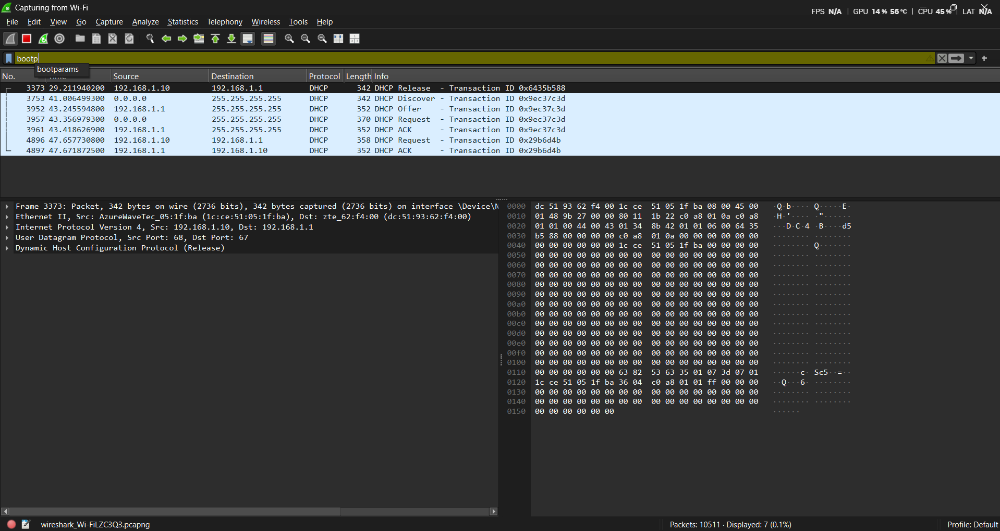
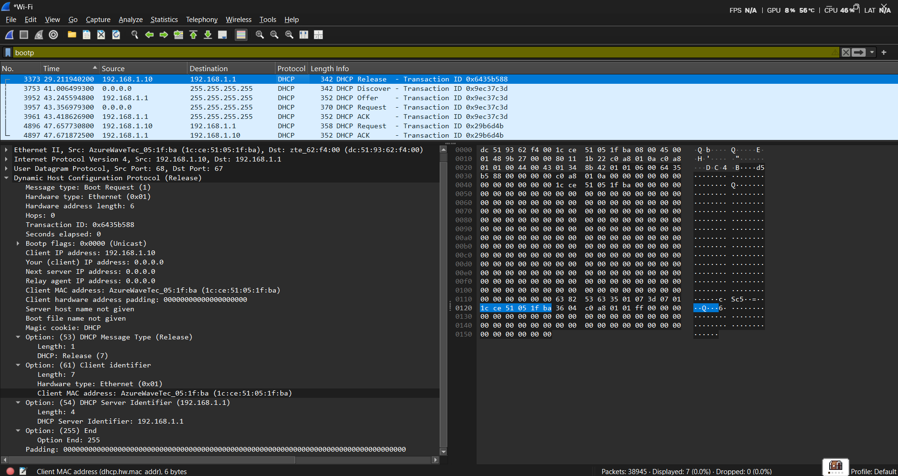
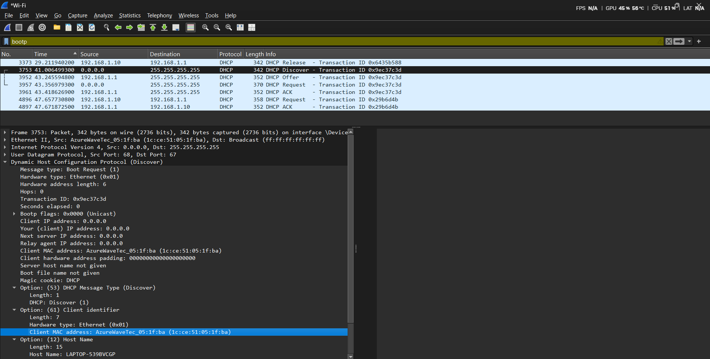
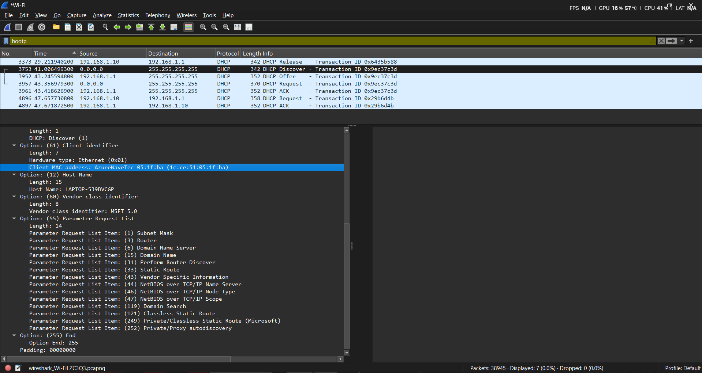
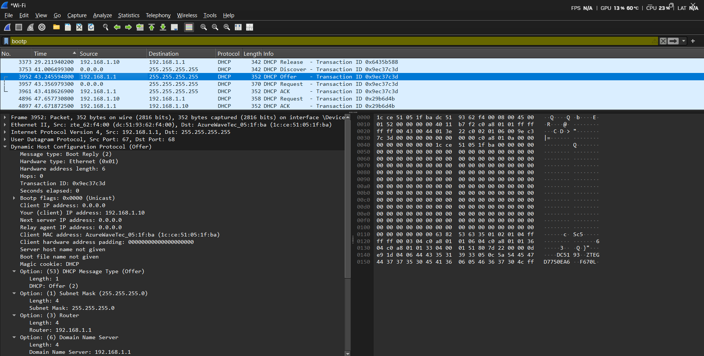
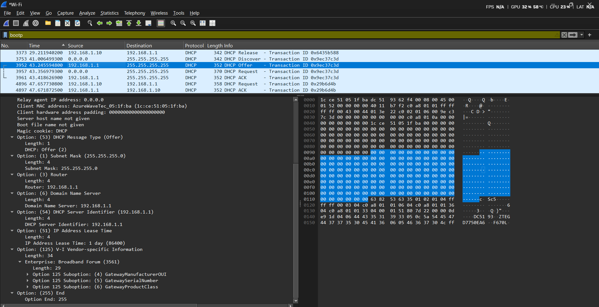
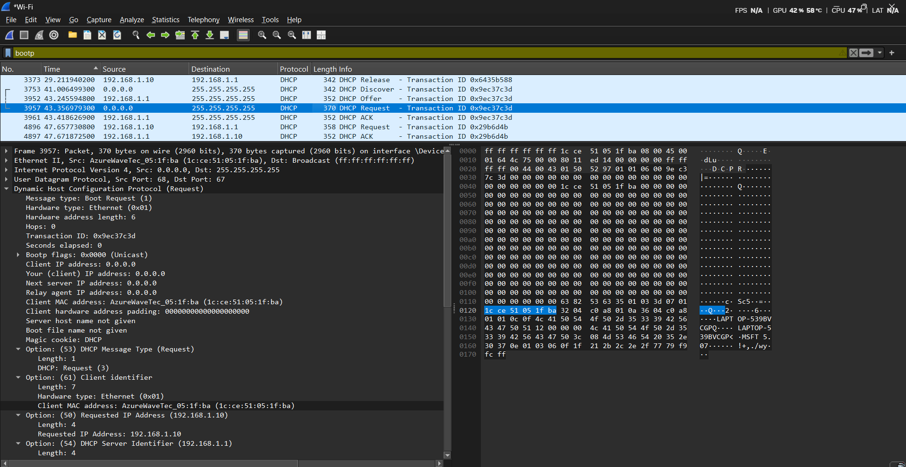
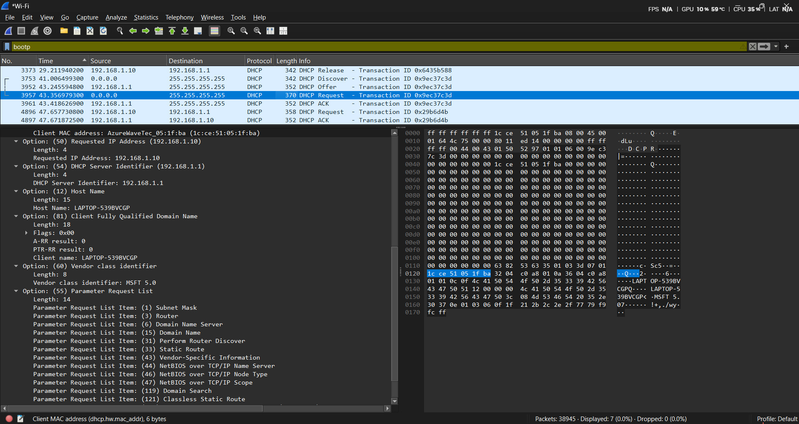
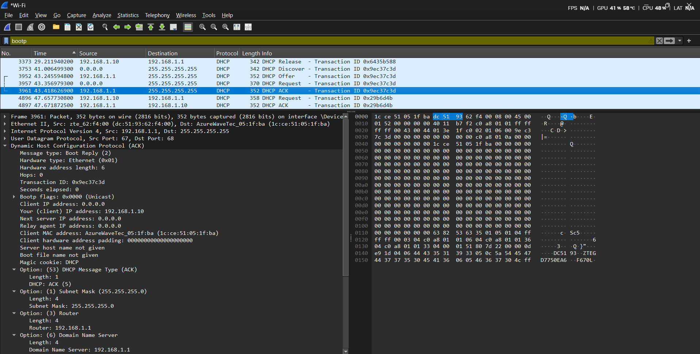
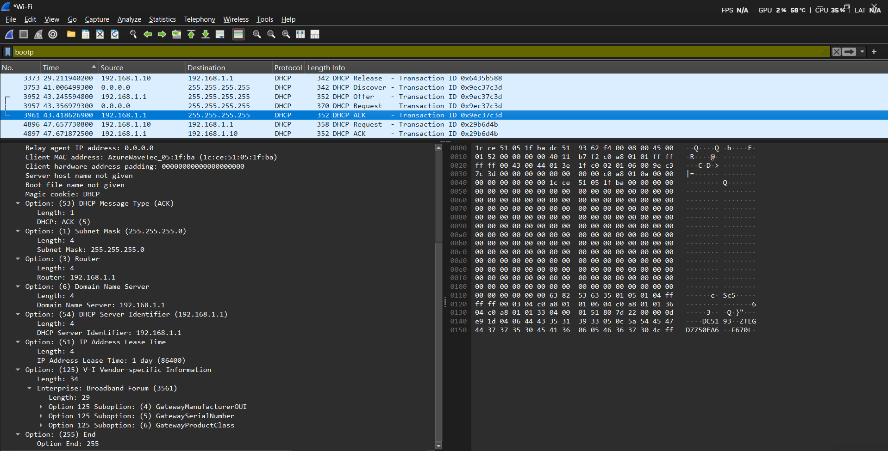

# Laporan Praktikum Jaringan Komputer - Modul 11
**Dynamic Host Configuration Protocol (DHCP)**

## Identitas Praktikan
| Keterangan | Imformasi |
| :--- | :--- |
| **Nama** | Alif Luthfan Adeefa |
| **NIM** | 103072400163 |
| **Kelas** | IF-04-01 |

---

## 1.1 Tujuan Praktikum
| No. | Tujuan Praktikum |
| :-: | :--- |
| 1 | Menangkap dan menganalisis paket DHCP menggunakan Wireshark. |
| 2 | Memahami proses DORA (*Discover-Offer-Request-ACK*). |
| 3 | Melihat konfigurasi jaringan yang diberikan DHCP server. |
| 4 | Menganalisis perbedaan mekanisme *broadcast* (*initial lease*) dan *unicast* (*renewal*) pada DHCP. |

## 1.2 Langkah Praktikum
Berikut adalah langkah-langkah yang dilakukan selama praktikum:
1. Buka Wireshark, lalu pilih *interface* Wi-Fi.
2. *Start Wireshark capture*.
3. Buka *Command Prompt* (CMD).
4. Jalankan perintah `ipconfig /release` (untuk melepaskan IP saat ini).
5. Jalankan perintah `ipconfig /renew` (untuk meminta IP baru).
6. *Stop capture* pada Wireshark setelah IP baru muncul.
7. Filter paket di Wireshark menggunakan *keyword* `bootp`.

---

## 1.3 Hasil Praktikum

### 1.3.1 Paket DHCP yang Berhasil Ditangkap

**Filter Wireshark:** `bootp`

**Tabel Paket DHCP:**
| Frame | Waktu | Message Type | Source | Destination | Transaction ID |
| :-: | :--- | :--- | :--- | :--- | :--- |
| 3373 | 29.21s | DHCP Release | 192.168.1.10 | 192.168.1.1 | 0x6435b588 |
| 3753 | 41.01s | DHCP Discover | 0.0.0.0 | 255.255.255.255 | 0x9ec37c3d |
| 3952 | 43.25s | DHCP Offer | 192.168.1.1 | 255.255.255.255 | 0x9ec37c3d |
| 3957 | 43.36s | DHCP Request | 0.0.0.0 | 255.255.255.255 | 0x9ec37c3d |
| 3961 | 43.42s | DHCP ACK | 192.168.1.1 | 255.255.255.255 | 0x9ec37c3d |
| 4896 | 47.66s | DHCP Request | 192.168.1.10 | 192.168.1.1 | 0x29b6d4b |
| 4897 | 47.67s | DHCP ACK | 192.168.1.1 | 192.168.1.10 | 0x29b6d4b |

> **Catatan:**
> * **Frame 3373:** Paket Release, dikirim saat menjalankan `ipconfig /release`, *transaction ID* terpisah dari sesi DORA.
> * **Frames 3753-3961:** Proses DORA awal (saat `ipconfig /renew`). *Transaction ID* `0x9ec37c3d` sama untuk 4 paket DORA (menandakan satu sesi DHCP).
> * **Frames 4896-4897:** DHCP Request & ACK berikutnya (*renewal*).

### 1.3.2 DHCP Release (Frame 3373)

* **Message type:** Boot Request (1) - Release
* **Transaction ID:** `0x6435b588`
* **Source:** 192.168.1.10
* **Destination:** 192.168.1.1 (*unicast*, langsung ke server)
> **Catatan:** Paket ini muncul karena perintah `ipconfig /release` dijalankan, sehingga *client* secara eksplisit memberitahu server untuk melepas alamat IP yang sedang dipinjamnya.

### 1.3.3 DHCP Discover (Frame 3753)

* **Message type:** Boot Request (1) - Discover
* **Transaction ID:** `0x9ec37c3d`
* **Hardware type:** Ethernet (0x01)
* **Client IP address:** 0.0.0.0 (belum punya IP)
* **Client MAC address:** AzureWaveTec_05:1f:ba (1c:ce:51:05:1f:ba)
* **Bootp flags:** 0x0000 (Unicast)
* **Options:**
  * (53) DHCP Message Type: Discover (1)
  * (61) Client identifier: AzureWaveTec_05:1f:ba
  * (12) Host Name: LAPTOP-539BVCGP
  * (60) Vendor class identifier: MSFT 5.0
  * (55) Parameter Request List: Subnet Mask (1), Router (3), Domain Name Server (6), Domain Name (15), Perform Router Discover (31), Static Route (33), dan 8 *options* lainnya.

### 1.3.4 DHCP Offer (Frame 3952)

* **Message type:** Boot Reply (2) - Offer
* **Transaction ID:** `0x9ec37c3d` (SAMA dengan Discover!)
* **Your (client) IP address:** 192.168.1.10
* **Client MAC address:** AzureWaveTec_05:1f:ba
* **Options:**
  * (53) DHCP Message Type: Offer (2)
  * (1) Subnet Mask: 255.255.255.0
  * (3) Router: 192.168.1.1
  * (6) Domain Name Server: 192.168.1.1
  * (54) DHCP Server Identifier: 192.168.1.1
  * (51) IP Address Lease Time: 1 day (86400 seconds)
  * (125) V-I Vendor-specific Information

### 1.3.5 DHCP Request (Frame 3957)

* **Message type:** Boot Request (1) - Request
* **Transaction ID:** `0x9ec37c3d`
* **Client IP address:** 0.0.0.0
* **Client MAC address:** AzureWaveTec_05:1f:ba
* **Options:**
  * (53) DHCP Message Type: Request (3)
  * (50) Requested IP Address: 192.168.1.10
  * (54) DHCP Server Identifier: 192.168.1.1
  * (12) Host Name: LAPTOP-539BVCGP
  * (81) Client Fully Qualified Domain Name: LAPTOP-539BVCGP
  * (60) Vendor class identifier: MSFT 5.0
  * (55) Parameter Request List: Subnet Mask, Router, DNS, Domain Name, dll.
> **Yang dilakukan client:** Menerima tawaran server, me-*request* IP 192.168.1.10 secara formal, dan memilih server 192.168.1.1.

### 1.3.6 DHCP ACK (Frame 3961)

* **Message type:** Boot Reply (2) - ACK
* **Transaction ID:** `0x9ec37c3d`
* **Your (client) IP address:** 192.168.1.10
* **Options:**
  * (53) DHCP Message Type: ACK (5)
  * (1) Subnet Mask: 255.255.255.0
  * (3) Router: 192.168.1.1
  * (6) Domain Name Server: 192.168.1.1
  * (54) DHCP Server Identifier: 192.168.1.1
  * (51) IP Address Lease Time: 1 day (86400 seconds)
  * (125) V-I Vendor-specific Information
> **Catatan Menarik:** *Lease time* yang ditawarkan pada saat Offer adalah 1 hari, dan pada saat ACK tetap 1 hari (konsisten, tidak berubah).

### 1.3.7 DHCP Renewal (Frames 4896 & 4897)

**Frame 4896 - DHCP Request:**
* **Source:** 192.168.1.10 (*client* sudah punya IP!)
* **Destination:** 192.168.1.1 (*unicast* ke server)
* **Transaction ID:** `0x29b6d4b` (ID baru)
* **Message Type:** Request

**Frame 4897 - DHCP ACK:**
* **Source:** 192.168.1.1
* **Destination:** 192.168.1.10 (*unicast*)
* **Transaction ID:** `0x29b6d4b`
* **Message Type:** ACK

---

## 1.4 Analisis Praktikum

### 1.4.1 Proses DORA yang Teramati
| Tahap | Waktu | Keterangan |
| :--- | :--- | :--- |
| **Discover** | 41.006s | Client kirim DHCP Discover (*broadcast*) |
| **Offer** | 43.245s | Server balas DHCP Offer (*broadcast*) |
| **Request** | 43.356s | Client kirim DHCP Request (*broadcast*) |
| **ACK** | 43.418s | Server kirim DHCP ACK (*broadcast*) |
| **Total Waktu Initial** | **~2.41 detik** | Dari Discover hingga ACK |
| **Renewal Req** | 47.657s | Client kirim DHCP Request (*unicast*) |
| **Renewal ACK** | 47.671s | Server balas DHCP ACK (*unicast*) |
| **Total Waktu Renewal** | **~0.014 detik** | Renewal jauh lebih cepat! |

**Perbedaan:**
* **Initial DORA:** Menggunakan *Broadcast*, membutuhkan 4 paket, memakan waktu ~2.41 detik.
* **Renewal:** Menggunakan *Unicast*, hanya butuh 2 paket (Request + ACK), memakan waktu ~0.014 detik.

### 1.4.2 Konfigurasi Jaringan yang Diberikan
| Parameter | Nilai | Keterangan |
| :--- | :--- | :--- |
| **IP Address** | 192.168.1.10 | Alamat *client* |
| **Subnet Mask** | 255.255.255.0 | Network /24 |
| **Default Gateway** | 192.168.1.1 | Router untuk akses internet |
| **DNS Server** | 192.168.1.1 | DNS *resolver* |
| **Lease Time** | 1 hari (86400s) | Masa berlaku peminjaman IP |
| **DHCP Server** | 192.168.1.1 | Server yang memberikan IP |

### 1.4.3 Transaction ID Analysis
* **Sesi Release:** Frame 3373 memiliki Transaction ID = `0x6435b588`
* **Sesi 1 (Initial DORA):** Frame 3753, 3952, 3957, dan 3961 menggunakan Transaction ID yang sama yaitu `0x9ec37c3d`.
* **Sesi 2 (Renewal):** Frame 4896 dan 4897 menggunakan Transaction ID baru yaitu `0x29b6d4b`.

**Kesimpulan:**
Transaction ID selalu sama dalam satu sesi DHCP yang utuh. Sesi yang berbeda (Release, DORA awal, Renewal) akan memiliki ID masing-masing karena *client* akan melakukan *generate random Transaction ID* untuk setiap sesi baru.

### 1.4.4 Broadcast vs Unicast
* **Initial DORA (Broadcast):**
  * Discover: `0.0.0.0` → `255.255.255.255` (*client* belum punya IP)
  * Offer: `192.168.1.1` → `255.255.255.255` (*broadcast*)
  * Request: `0.0.0.0` → `255.255.255.255` (*broadcast*)
  * ACK: `192.168.1.1` → `255.255.255.255` (*broadcast*)
* **Renewal (Unicast):**
  * Request: `192.168.1.10` → `192.168.1.1` (*unicast*)
  * ACK: `192.168.1.1` → `192.168.1.10` (*unicast*)
* **Release (Unicast):**
  * Release: `192.168.1.10` → `192.168.1.1` (*unicast*)

### 1.4.5 Lease Time Analysis
Dari observasi Wireshark:
* **Offer:** Lease time = 86400 seconds (1 hari)
* **ACK:** Lease time = 86400 seconds (1 hari)

**Catatan:** Berbeda dengan beberapa kasus di mana *lease time* bisa berubah antara Offer dan ACK (karena server melakukan penyesuaian saat finalisasi), pada percobaan ini *lease time* tetap konsisten 1 hari. Ini menunjukkan server langsung menetapkan kebijakan *lease time* final sejak tahap Offer.

---

## 1.5 Kesimpulan

### A. Poin-Poin Keberhasilan Praktikum
| No. | Aspek Analisis | Hasil yang Berhasil Dilakukan |
| :-: | :--- | :--- |
| 1 | Penangkapan Paket | Berhasil menangkap 1 paket Release, 4 paket DHCP utama, dan 2 paket renewal. |
| 2 | Proses DORA | Berjalan lengkap (Discover mencari server, Offer menambahkan IP 192.168.1.10, Request meminta IP, ACK mengonfirmasi). |
| 3 | Transaction ID | Terbukti konsisten (`0x9ec37c3d`) untuk seluruh sesi initial DORA, dan berbeda untuk Release/Renewal. |
| 4 | Konfigurasi Jaringan | Berhasil mendapatkan parameter lengkap (IP, Subnet, Gateway, DNS, dan Lease Time). |
| 5 | Metode Pengiriman | Terlihat perbedaan yang jelas; DORA awal menggunakan *broadcast*, sedangkan Renewal/Release menggunakan *unicast*. |
| 6 | Efektivitas Alat | Wireshark terbukti efektif untuk analisis protokol DHCP menggunakan filter `bootp`. |

### B. Temuan Menarik Selama Praktikum
| No. | Objek Temuan | Deskripsi Analisis Temuan |
| :-: | :--- | :--- |
| 1 | Paket Release | Perintah `ipconfig /release` menghasilkan paket tersendiri dengan ID yang berbeda, membuktikan bahwa Release adalah sesi independen. |
| 2 | Konsistensi Lease Time | *Lease time* pada Offer dan ACK sama persis (1 hari), menunjukkan kebijakan server sudah final sejak awal ditawarkan. |
| 3 | Kecepatan Proses | Proses Renewal jauh lebih efisien dan cepat (~0.014s) dibandingkan DORA awal (~2.41s) karena langsung menggunakan jalur *unicast*. |
| 4 | Infrastruktur Jaringan | Alamat Gateway dan DNS menggunakan IP yang identik (192.168.1.1), mengindikasikan penggunaan satu perangkat multifungsi (seperti *router* rumahan). |