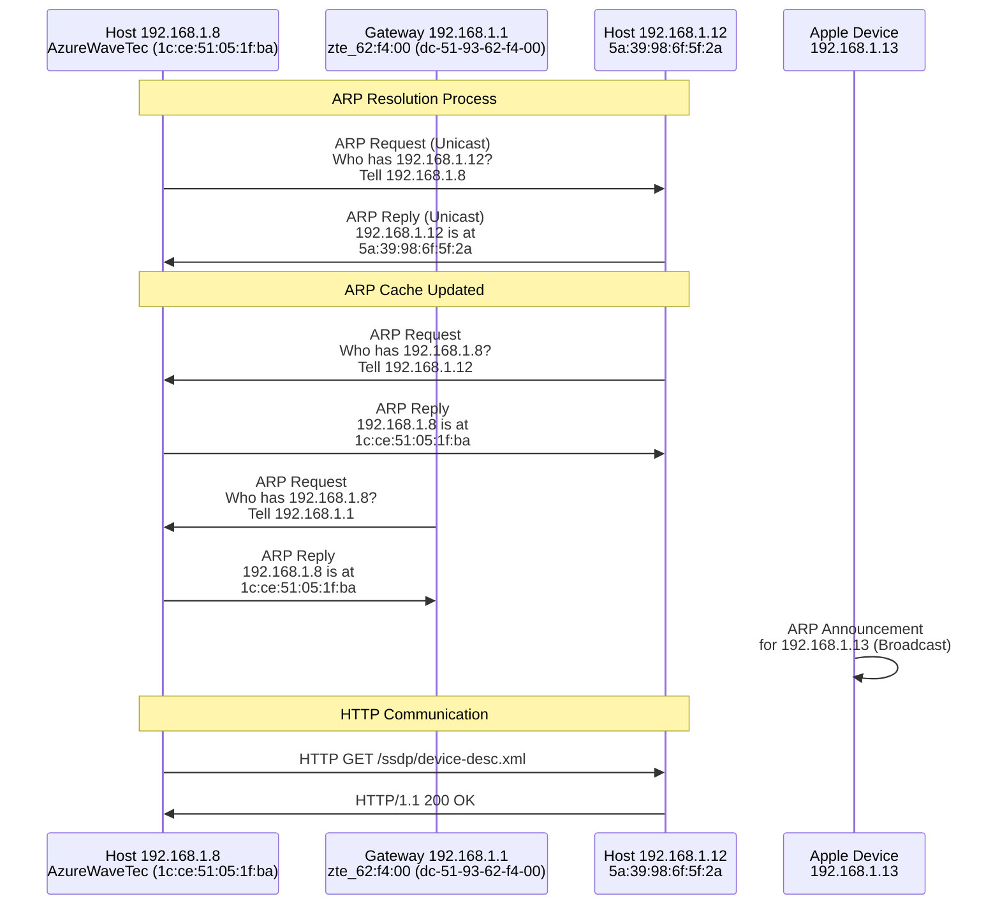

# Laporan Praktikum Jaringan Komputer - Modul 13

## Identitas Praktikan

| Keterangan | Imformasi |
| :--- | :--- |
| **Nama** | Alif Luthfan Adeefa |
| **NIM** | 103072400163 |
| **Kelas** | IF-04-01 |

---

## 1. Tujuan Praktikum

Berdasarkan modul praktikum Jaringan Komputer Semester Genap 2025/2026, tujuan dari Modul 13 adalah:

| No | Tujuan Praktikum |
| :---: | :--- |
| **1** | Mahasiswa dapat menginvestigasi cara kerja Ethernet dan ARP menggunakan Wireshark |
| **2** | Mahasiswa mampu menganalisis struktur frame Ethernet |
| **3** | Mahasiswa memahami mekanisme Address Resolution Protocol (ARP) |
| **4** | Mahasiswa dapat menganalisis cache ARP dan proses resolusi alamat |

---

## 2. Langkah Kerja

Berikut adalah langkah-langkah yang dilakukan selama praktikum Modul 13:

### 2.1 Persiapan dan Capture Frame Ethernet

1. Membersihkan cache browser (Mozilla Firefox: Tools -> Clear Recent History -> Cache)
2. Membuka Wireshark dan memulai packet capture pada interface **Wi-Fi (Wireless LAN adapter)**
3. Mengakses URL: `http://gaia.cs.umass.edu/wireshark-labs/HTTP-ethereal-lab-file3.html`
4. Browser menampilkan dokumen "Bill of Rights AS"
5. Menghentikan capture dan menganalisis frame Ethernet

### 2.2 Analisis ARP Cache

1. Melihat isi ARP cache menggunakan perintah:
   - **Windows**: `arp -a` di command prompt
2. Mengamati entry dynamic dan static dalam ARP cache pada dua interface aktif
3. Mengidentifikasi interface network yang aktif

### 2.3 Mengamati Aksi ARP

1. Membersihkan cache ARP dan cache browser
2. Memulai Wireshark capture
3. Mengakses URL yang sama
4. Menganalisis paket ARP Request dan ARP Reply
5. Menggunakan filter `arp.opcode == 2` untuk melihat ARP Reply
6. Menggunakan filter `arp` untuk melihat semua traffic ARP

---

## 3. Hasil dan Pembahasan

### 3.1 Konfigurasi Network Interface


*Gambar 1: Output ipconfig /all menunjukkan konfigurasi network adapter*

#### Informasi Network Interface — Wireless LAN adapter Wi-Fi (Primary)

| Parameter | Nilai |
|-----------|-------|
| **Adapter** | Realtek 8852BE Wireless LAN WiFi 6 PCI-E NIC |
| **Physical Address (MAC)** | 1C-CE-51-05-1F-BA |
| **IPv4 Address** | 192.168.1.8 |
| **Subnet Mask** | 255.255.255.0 |
| **Default Gateway** | 192.168.1.1 |
| **DHCP Server** | 192.168.1.1 |
| **DNS Server** | 192.168.1.1 |
| **Lease Obtained** | Wednesday, 24 June 2026 20:47:08 |
| **Lease Expires** | Thursday, 25 June 2026 20:57:35 |

#### Informasi Network Interface — Wireless LAN adapter Wi-Fi 2 (Secondary)

| Parameter | Nilai |
|-----------|-------|
| **Adapter** | Realtek RTL8188EU Wireless LAN 802.11n USB 2.0 Network Adapter |
| **Physical Address (MAC)** | 30-68-93-05-79-21 |
| **IPv4 Address** | 192.168.1.11 |
| **Subnet Mask** | 255.255.255.0 |
| **Default Gateway** | 192.168.1.1 |
| **DHCP Server** | 192.168.1.1 |
| **DNS Server** | 192.168.1.1 |
| **Lease Obtained** | Wednesday, 24 June 2026 21:35:03 |
| **Lease Expires** | Thursday, 25 June 2026 21:35:03 |

**Penjelasan:**
Terdapat dua interface Wi-Fi yang aktif pada perangkat ini. Interface utama (Wi-Fi) menggunakan adapter Realtek 8852BE WiFi 6 dengan IP 192.168.1.8, sedangkan interface sekunder (Wi-Fi 2) menggunakan adapter USB RTL8188EU dengan IP 192.168.1.11. Keduanya terhubung ke jaringan yang sama dengan gateway 192.168.1.1 dan mendapatkan IP secara dinamis melalui DHCP.

---

### 3.2 ARP Cache Analysis


*Gambar 2: Output perintah arp -a menunjukkan ARP cache table*

#### ARP Cache Table — Interface 192.168.1.8 (0xa)

| Internet Address | Physical Address | Type |
|-----------------|------------------|------|
| 192.168.1.1 | dc-51-93-62-f4-00 | dynamic |
| 192.168.1.6 | 2c-1b-3a-47-48-9a | dynamic |
| 192.168.1.12 | 5a-39-98-6f-5f-2a | dynamic |
| 192.168.1.255 | ff-ff-ff-ff-ff-ff | static |
| 224.0.0.22 | 01-00-5e-00-00-16 | static |
| 224.0.0.251 | 01-00-5e-00-00-fb | static |
| 224.0.0.252 | 01-00-5e-00-00-fc | static |
| 239.255.255.250 | 01-00-5e-7f-ff-fa | static |
| 255.255.255.255 | ff-ff-ff-ff-ff-ff | static |

#### ARP Cache Table — Interface 192.168.1.11 (0xf)

| Internet Address | Physical Address | Type |
|-----------------|------------------|------|
| 192.168.1.1 | dc-51-93-62-f4-00 | dynamic |
| 192.168.1.6 | 2c-1b-3a-47-48-9a | dynamic |
| 192.168.1.12 | 5a-39-98-6f-5f-2a | dynamic |
| 192.168.1.255 | ff-ff-ff-ff-ff-ff | static |
| 224.0.0.22 | 01-00-5e-00-00-16 | static |
| 224.0.0.251 | 01-00-5e-00-00-fb | static |
| 224.0.0.252 | 01-00-5e-00-00-fc | static |
| 239.255.255.250 | 01-00-5e-7f-ff-fa | static |
| 255.255.255.255 | ff-ff-ff-ff-ff-ff | static |

**Penjelasan:**
- **Dynamic entries**: Entry yang dipelajari secara otomatis melalui protokol ARP. Terdapat 3 entry dynamic yang menunjukkan perangkat yang aktif berkomunikasi dalam jaringan lokal, yaitu gateway (192.168.1.1), dan dua host lain (192.168.1.6 dan 192.168.1.12).
- **Static entries**: Entry yang sudah ada secara permanen dan tidak perlu di-resolve melalui ARP, biasanya untuk alamat broadcast (192.168.1.255 dan 255.255.255.255) dan multicast addresses (224.x.x.x dan 239.x.x.x).
- Kedua interface aktif memiliki ARP cache yang identik karena berada dalam jaringan yang sama (192.168.1.0/24).

---

### 3.3 Analisis ARP Reply

<!-- ============================================================ -->
<!-- 📸 GAMBAR 3: Screenshot Wireshark filter arp.opcode == 2,    -->
<!--    klik Frame 88, tampilkan panel detail ARP reply           -->
<!--    Masukkan di sini                                          -->
<!-- ============================================================ -->


*Gambar 3: Detail ARP Reply packet (Frame 88)*

#### ARP Reply Structure (Frame 88)

| Field | Nilai | Keterangan |
|-------|-------|-----------|
| **Frame Number** | 88 | |
| **Time** | 6.639914000 detik | |
| **Source MAC** | 5a:39:98:6f:5f:2a | MAC address pengirim reply |
| **Destination MAC** | AzureWaveTec_05:1f:ba (1c:ce:51:05:1f:ba) | MAC address tujuan |
| **Protocol** | ARP (0x0806) | |
| **Hardware Type** | Ethernet (1) | |
| **Protocol Type** | IPv4 (0x0800) | |
| **Hardware Size** | 6 | Panjang MAC address (bytes) |
| **Protocol Size** | 4 | Panjang IP address (bytes) |
| **Opcode** | reply (2) | ARP Reply |
| **Sender MAC** | 5a:39:98:6f:5f:2a | |
| **Sender IP** | 192.168.1.12 | |
| **Target MAC** | 1c:ce:51:05:1f:ba | MAC address yang dicari |
| **Target IP** | 192.168.1.8 | IP address requester |

#### Detail Ethernet Header (Frame 88)

```
Ethernet II, Src: 5a:39:98:6f:5f:2a, Dst: AzureWaveTec_05:1f:ba (1c:ce:51:05:1f:ba)
    Destination: AzureWaveTec_05:1f:ba (1c:ce:51:05:1f:ba)
        .... ..0. .... .... .... .... = LG bit: Globally unique address (factory default)
        .... ...0 .... .... .... .... = IG bit: Individual address (unicast)
    Source: 5a:39:98:6f:5f:2a
        .... ..1. .... .... .... .... = LG bit: Locally administered address
        .... ...0 .... .... .... .... = IG bit: Individual address (unicast)
    Type: ARP (0x0806)

Address Resolution Protocol (reply)
    Hardware type: Ethernet (1)
    Protocol type: IPv4 (0x0800)
    Hardware size: 6
    Protocol size: 4
    Opcode: reply (2)
    Sender MAC address: 5a:39:98:6f:5f:2a
    Sender IP address: 192.168.1.12
    Target MAC address: AzureWaveTec_05:1f:ba (1c:ce:51:05:1f:ba)
    Target IP address: 192.168.1.8
```

**Penjelasan:**
- ARP Reply dikirim sebagai **unicast** langsung ke host yang meminta (192.168.1.8 / 1c:ce:51:05:1f:ba)
- Host 192.168.1.12 memberikan informasi MAC address-nya (5a:39:98:6f:5f:2a) kepada 192.168.1.8
- Pengiriman bersifat point-to-point, tidak di-broadcast ke seluruh jaringan
- Opcode bernilai 2 menandakan ini adalah paket ARP Reply

---

### 3.4 Analisis ARP Request


*Gambar 4: ARP Request (Frame 87)*

#### ARP Request Structure (Frame 87)

| Field | Nilai | Keterangan |
|-------|-------|-----------|
| **Frame Number** | 87 | |
| **Time** | 6.635393600 detik | |
| **Source MAC** | AzureWaveTec_05:1f:ba (1c:ce:51:05:1f:ba) | MAC address pengirim request |
| **Destination MAC** | 5a:39:98:6f:5f:2a | Destination (gateway/router) |
| **Protocol** | ARP (0x0806) | |
| **Hardware Type** | Ethernet (1) | |
| **Protocol Type** | IPv4 (0x0800) | |
| **Hardware Size** | 6 | |
| **Protocol Size** | 4 | |
| **Opcode** | request (1) | ARP Request |
| **Sender MAC** | 1c:ce:51:05:1f:ba | MAC address pengirim |
| **Sender IP** | 192.168.1.8 | IP address pengirim |
| **Target MAC** | 5a:39:98:6f:5f:2a | MAC address yang dicari |
| **Target IP** | 192.168.1.12 | IP address yang dicari |

#### Detail Packet (Frame 87)

```
Ethernet II, Src: AzureWaveTec_05:1f:ba (1c:ce:51:05:1f:ba), Dst: 5a:39:98:6f:5f:2a
    Destination: 5a:39:98:6f:5f:2a
    Source: AzureWaveTec_05:1f:ba (1c:ce:51:05:1f:ba)
        .... ..0. .... .... .... .... = LG bit: Globally unique address (factory default)
        .... ...0 .... .... .... .... = IG bit: Individual address (unicast)
    Type: ARP (0x0806)

Address Resolution Protocol (request)
    Hardware type: Ethernet (1)
    Protocol type: IPv4 (0x0800)
    Hardware size: 6
    Protocol size: 4
    Opcode: request (1)
    Sender MAC address: AzureWaveTec_05:1f:ba (1c:ce:51:05:1f:ba)
    Sender IP address: 192.168.1.8
    Target MAC address: 5a:39:98:6f:5f:2a
    Target IP address: 192.168.1.12
```

**Penjelasan:**
- ARP Request dikirim oleh host 192.168.1.8 untuk mengetahui MAC address dari host 192.168.1.12
- Opcode bernilai 1 menandakan ini adalah paket ARP Request
- Host dengan IP 192.168.1.12 yang sesuai akan merespons dengan ARP Reply

#### Traffic Pattern ARP dalam Capture

Dari packet list dengan filter `arp` terlihat berbagai ARP traffic:

| Frame No. | Source | Destination | Info |
|-----------|--------|-------------|------|
| 87 | AzureWaveTec_05:1f:ba | 5a:39:98:6f:5f:2a | Who has 192.168.1.12? Tell 192.168.1.8 |
| 88 | 5a:39:98:6f:5f:2a | AzureWaveTec_05:1f:... | 192.168.1.12 is at 5a:39:98:6f:5f:2a |
| 281 | 5a:39:98:6f:5f:2a | AzureWaveTec_05:1f:... | Who has 192.168.1.8? Tell 192.168.1.12 |
| 282 | AzureWaveTec_05:1f:ba | 5a:39:98:6f:5f:2a | 192.168.1.8 is at 1c:ce:51:05:1f:ba |
| 443 | zte_62:f4:00 | AzureWaveTec_05:1f:... | Who has 192.168.1.8? Tell 192.168.1.1 |
| 444 | AzureWaveTec_05:1f:ba | zte_62:f4:00 | 192.168.1.8 is at 1c:ce:51:05:1f:ba |
| 2268 | Apple_0e:a1:88 | Broadcast | ARP Announcement for 192.168.1.13 |
| 2269 | Apple_0e:a1:88 | Broadcast | Who has 192.168.1.1? Tell 192.168.1.13 |

**Pattern Analysis:**
- Terdapat komunikasi ARP dua arah antara host 192.168.1.8 dan 192.168.1.12
- Gateway (192.168.1.1 / zte_62:f4:00) juga melakukan ARP Request ke host 192.168.1.8
- Sebuah perangkat Apple (192.168.1.13) melakukan ARP Announcement saat bergabung ke jaringan
- ARP Announcement menggunakan Broadcast untuk memberitahu semua perangkat di jaringan

---

### 3.5 Analisis HTTP over Ethernet


*Gambar 5: HTTP GET Request (Frame 2121)*

#### Informasi Paket HTTP

| Field | Nilai |
|-------|-------|
| **Frame Number** | 2121 |
| **Time** | 123.217492800 detik |
| **Source IP** | 192.168.1.8 |
| **Destination IP** | 192.168.1.12 |
| **Source MAC** | AzureWaveTec_05:1f:ba (1c:ce:51:05:1f:ba) |
| **Destination MAC** | 5a:39:98:6f:5f:2a |
| **Protocol** | HTTP |
| **Request** | GET /ssdp/device-desc.xml HTTP/1.1 |
| **Host** | 192.168.1.12:8008 |
| **Source Port** | 62241 |
| **Destination Port** | 8008 |
| **Frame Size** | 298 bytes (2384 bits) |
| **Response** | HTTP/1.1 200 OK (Frame 2146) |

#### Stack Protokol

```
Frame 2121: 298 bytes on wire (2384 bits), 298 bytes captured (2384 bits)
├─ Ethernet II (Layer 2)
│  ├─ Source: AzureWaveTec_05:1f:ba (1c:ce:51:05:1f:ba)
│  ├─ Destination: 5a:39:98:6f:5f:2a
│  └─ Type: IPv4 (0x0800)
├─ Internet Protocol Version 4 (Layer 3)
│  ├─ Version: 4
│  ├─ Source Address: 192.168.1.8
│  └─ Destination Address: 192.168.1.12
├─ Transmission Control Protocol (Layer 4)
│  ├─ Source Port: 62241
│  ├─ Destination Port: 8008
│  └─ Seq: 1, Ack: 1, Len: 244
└─ Hypertext Transfer Protocol (Layer 7)
   ├─ GET /ssdp/device-desc.xml HTTP/1.1
   ├─ Host: 192.168.1.12:8008
   ├─ Connection: keep-alive
   ├─ User-Agent: Mozilla/5.0 (Windows NT 10.0; Win64; x64) AppleWebKit/537.36
   └─ [Response in frame: 2146]
```

**Penjelasan:**
- HTTP GET request dikirim dari client (192.168.1.8) ke server lokal (192.168.1.12) pada port 8008
- Server merespons dengan **HTTP/1.1 200 OK** (frame 2146), artinya request berhasil dan konten dikembalikan
- Komunikasi terjadi dalam jaringan lokal (LAN), bukan ke internet
- TCP digunakan sebagai transport layer dengan destination port 8008 (bukan port 80 standar HTTP)
- User-Agent menunjukkan browser Chrome berbasis Windows 10

---

### 3.6 Perbandingan ARP Request dan ARP Reply

| Aspek | ARP Request | ARP Reply |
|-------|-------------|-----------|
| **Opcode** | 1 (request) | 2 (reply) |
| **Destination MAC** | Unicast ke gateway (5a:39:98:6f:5f:2a) | Unicast ke requester (1c:ce:51:05:1f:ba) |
| **Target MAC** | 5a:39:98:6f:5f:2a | 1c:ce:51:05:1f:ba |
| **Direction** | Point-to-point | Point-to-point (unicast) |
| **Purpose** | Mencari MAC address dari IP 192.168.1.12 | Memberikan MAC address 5a:39:98:6f:5f:2a |
| **Sender IP** | 192.168.1.8 | 192.168.1.12 |
| **Sender MAC** | 1c:ce:51:05:1f:ba | 5a:39:98:6f:5f:2a |

---

### 3.7 Analisis Traffic Pattern



### 3.8 Struktur Frame Ethernet

#### Ethernet Frame Standar (dari capture)

```
+------------------+------------------+------------------+
| Dest MAC         | Source MAC       | EtherType        |
| (6 bytes)        | (6 bytes)        | 0x0806 (ARP)     |
|                  |                  | 0x0800 (IPv4)    |
+------------------+------------------+------------------+
| Payload (46-1500 bytes)                                |
| - ARP packet (28 bytes untuk IPv4/Ethernet)            |
| - atau IP packet + TCP + HTTP                          |
+------------------+------------------+------------------+
| Frame Check Sequence (FCS)                             |
| (4 bytes)                                              |
+------------------+------------------+------------------+
```

#### ARP Packet Structure (28 bytes)

```
+------------+------------+----------+----------+---------+
| HW Type    | Proto Type | HW Size  | PR Size  | Opcode  |
| (2 bytes)  | (2 bytes)  | (1 byte) | (1 byte) | (2 byte)|
| 0x0001     | 0x0800     | 0x06     | 0x04     | 1 or 2  |
+------------+------------+----------+----------+---------+
| Sender MAC (6 bytes)    | Sender IP (4 bytes)           |
+-------------------------+-------------------------------+
| Target MAC (6 bytes)    | Target IP (4 bytes)           |
+-------------------------+-------------------------------+
```

---

### 3.9 Kesimpulan Praktikum

Berdasarkan praktikum yang telah dilakukan, dapat disimpulkan:

1. **Konfigurasi Network Interface**
   - Perangkat memiliki dua interface Wi-Fi aktif secara bersamaan
   - Interface utama (Wi-Fi): Realtek 8852BE WiFi 6, MAC 1C-CE-51-05-1F-BA, IP 192.168.1.8
   - Interface sekunder (Wi-Fi 2): Realtek RTL8188EU USB, MAC 30-68-93-05-79-21, IP 192.168.1.11
   - Keduanya terhubung ke router yang sama (gateway 192.168.1.1)

2. **ARP Cache Management**
   - ARP cache pada kedua interface berisi entry dynamic (3 entries) dan static (6 entries)
   - Entry dynamic untuk: gateway (192.168.1.1), host 192.168.1.6, dan host 192.168.1.12
   - Entry static untuk: broadcast lokal, limited broadcast, dan multicast addresses
   - ARP cache memungkinkan perangkat untuk tidak selalu mengirim ARP Request setiap kali komunikasi

3. **ARP Request dan Reply**
   - ARP Request (Frame 87) dikirim dari 192.168.1.8 untuk mencari MAC dari 192.168.1.12
   - ARP Reply (Frame 88) dikirim unicast dari 192.168.1.12 ke 192.168.1.8
   - ARP menggunakan opcode: 1 (request) dan 2 (reply)
   - Selain ARP biasa, ditemukan juga ARP Announcement dari perangkat Apple yang baru bergabung ke jaringan

4. **HTTP over TCP/IP over Ethernet**
   - HTTP GET request dikirim dari 192.168.1.8 ke server lokal 192.168.1.12 port 8008
   - Server merespons dengan HTTP/1.1 200 OK (konten berhasil dikirim)
   - Berbeda dengan teori umum (port 80), komunikasi ini menggunakan port 8008 karena server lokal (bukan web server publik)
   - HTTP request dibungkus TCP → IP → Ethernet secara berlapis (encapsulation)

5. **MAC Address Types**
   - Globally unique address (factory default): LG bit = 0 (contoh: 1c:ce:51:05:1f:ba)
   - Locally administered address: LG bit = 1 (contoh: 5a:39:98:6f:5f:2a — menandakan MAC virtual/generated)
   - Individual address (unicast): IG bit = 0
   - Group address (multicast/broadcast): IG bit = 1

---

## 4. Ringkasan Data

### 4.1 Network Information

**Interface Aktif:**

| Interface | IP Address | MAC Address | Adapter |
|-----------|-----------|-------------|---------|
| Wi-Fi (0xa) | 192.168.1.8 | 1C-CE-51-05-1F-BA | Realtek 8852BE WiFi 6 |
| Wi-Fi 2 (0xf) | 192.168.1.11 | 30-68-93-05-79-21 | Realtek RTL8188EU USB |

**ARP Cache Entries (Interface 192.168.1.8):**
- Dynamic: 3 entries (192.168.1.1, 192.168.1.6, 192.168.1.12)
- Static: 6 entries (broadcast dan multicast addresses)

**Traffic yang Dianalisis:**
- ARP Request: Frame 87 — Who has 192.168.100.12? Tell 192.168.1.8
- ARP Reply: Frame 88 — 192.168.1.12 is at 5a:39:98:6f:5f:2a
- HTTP: Frame 2121 — GET /ssdp/device-desc.xml → 200 OK

---

> **Catatan Pengerjaan Laporan:**
> 
> Masukkan screenshot sesuai urutan berikut:
> - **Gambar 1** → Screenshot `ipconfig /all` dari CMD (Section 3.1)
> - **Gambar 2** → Screenshot `arp -a` dari CMD (Section 3.2)
> - **Gambar 3** → Screenshot Wireshark filter `arp.opcode == 2`, Frame 88 dipilih dengan detail ARP reply terbuka (Section 3.3)
> - **Gambar 4** → Screenshot Wireshark filter `arp`, Frame 87 dipilih dengan detail ARP request terbuka (Section 3.4)
> - **Gambar 5** → Screenshot Wireshark filter `http`, Frame 2121 dipilih dengan detail HTTP terbuka (Section 3.5)