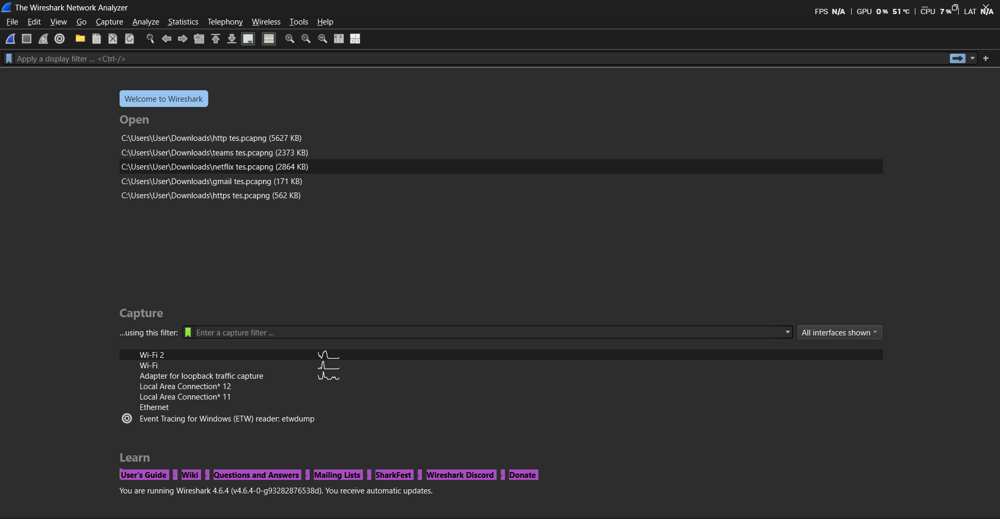
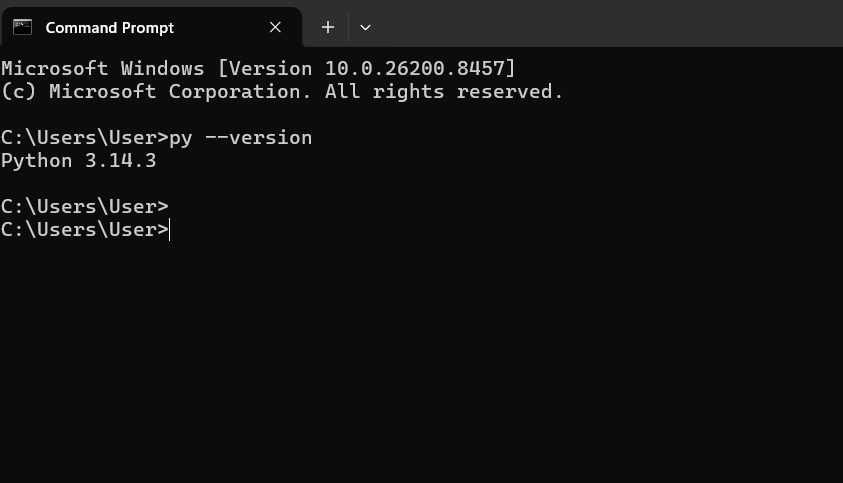

# Laporan Praktikum Jaringan Komputer - Modul 1

### Identitas Praktikan

| Item | Keterangan |
| :--- | :--- |
| **Nama** | Alif Luthfan Adeefa |
| **NIM** | 103072400163 |
| **Kelas** | IF-04-01 |

---

### 1. Tujuan Praktikum

Berdasarkan modul praktikum Jaringan Komputer Semester Genap 2025/2026, tujuan dari Modul 1 adalah:

1. Mahasiswa mengetahui aturan dan sistem pelaksanaan praktikum.
2. Mahasiswa mengetahui tools yang akan digunakan dan memastikan tools berfungsi dengan baik.

### 2. Tools
2.1 Wireshark
Wireshark adalah aplikasi packet sniffer yang digunakan untuk menganalisis protokol jaringan.

* Versi: 4.6.4
* Link Download: www.wireshark.org

2.2 Python
    Python digunakan untuk modul Socket Programming.

* Versi: 3.13.7
* Link Download: www.python.org

### 3. Langkah Kerja

Berikut adalah langkah-langkah yang dilakukan selama praktikum Modul 1:

Briefing Aturan Praktikum

1. **Briefing Aturan Praktikum**
   * Mendengarkan penjelasan asisten mengenai tata tertib laboratorium.
   * Memahami sistem penilaian, kehadiran (minimal 75%), dan sanksi pelanggaran.
   * Memahami alur 16 modul praktikum hingga Tugas Besar.

2. **Pengecekan Tools**
   * Memastikan Wireshark dan Python sudah terinstall di komputer laboratorium/personal.
   * Melakukan update jika diperlukan.

3. **Test Run Wireshark**
   * Membuka aplikasi Wireshark.
   * Mengamati fitur dasar Wireshark (Packet List, Packet Details, Packet Bytes).

### 4. Hasil dan Pembahasan

4.1 Tampilan Awal Wireshark
Berikut adalah tampilan awal Wireshark sebelum membuka file trace. Terlihat daftar interface jaringan yang tersedia.

4.2 Verifikasi Python
Berikut adalah tangkapan layar Command Prompt/Terminal saat mengecek versi Python untuk memastikan tools siap digunakan pada modul selanjutnya (Modul 7 & 9).

### 5. Kesimpulan
Berdasarkan praktikum Modul 1 ini, dapat disimpulkan bahwa:

* Praktikan telah memahami aturan main, sistem penilaian, dan sanksi yang berlaku di Laboratorium Informatika Universitas Telkom.
* Tools utama yaitu Wireshark dan Python telah berhasil diinstall dan berfungsi dengan baik.
* Praktikan mampu memahami antarmuka dasar Wireshark yang akan digunakan pada modul-modul selanjutnya (HTTP, DNS, TCP, dll).
* Kesiapan tools ini sangat penting untuk kelancaran praktikum hingga penyusunan Tugas Besar.
