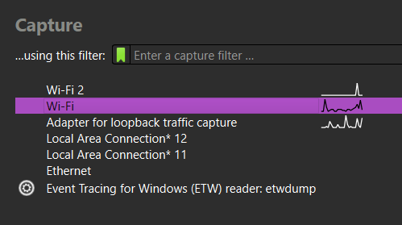
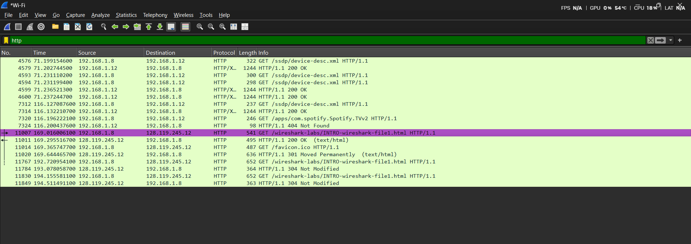
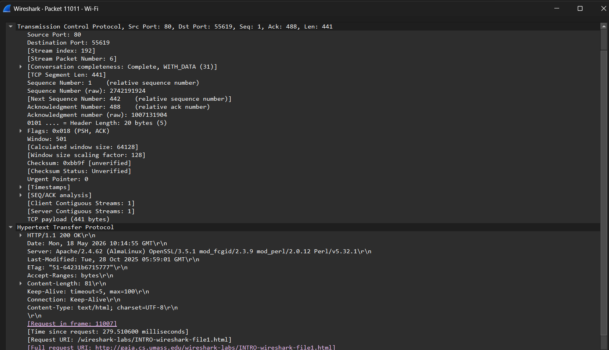
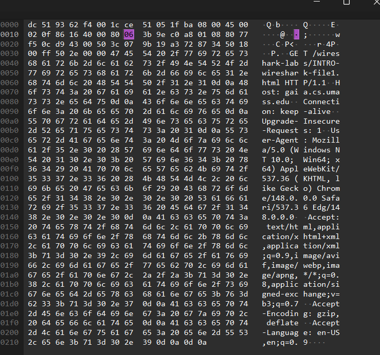

# Laporan Praktikum Jaringan Komputer - Modul 1

### Identitas Praktikan

| Item | Keterangan |
| :--- | :--- |
| **Nama** | Alif Luthfan Adeefa |
| **NIM** | 103072400163 |
| **Kelas** | IF-04-01 |

---

### 1. Tujuan Praktikum
Berdasarkan modul praktikum Jaringan Komputer, tujuan dari Modul 2 adalah:
1. Mengoperasikan Wireshark untuk menangkap lalu lintas paket data.
2. Mengidentifikasi dan menganalisis struktur paket berdasarkan lapisan protokol.

---

### 2. Landasan Teori
2.1 Packet Sniffer
Wireshark merupakan implementasi dari Packet Sniffer, yaitu perangkat lunak yang berfungsi secara pasif yaitu memonitor dan merekam pertukaran pesan antar entitas protokol dalam jaringan komputer.

2.2 Struktur Packet Sniffer
| No | Komponen | Fungsi |
| :--- | :--- | :--- |
| 1 | **Command Menu** | Menu pull-down standar (File, Capture, Analyze, Help, dll.) |
| 2 | **Packet Listing Window** | Menampilkan ringkasan satu baris per paket (No, Time, Source, Destination, Protocol, Info) |
| 3 | **Packet Header Details Window** | Menampilkan rincian hierarkis protokol paket yang dipilih |
| 4 | **Packet Contents Window** | Menampilkan isi frame dalam format heksadesimal dan ASCII |
| 5 | **Display Filter Field** | Kolom input untuk menyaring paket berdasarkan protokol atau kriteria tertentu |

---

### 3. Langkah kerja
Proses pengambilan dan analisis data dilakukan dengan mengikuti prosedur berikut:

3.1 Tahapan praktikum

| Tahap | Aktivitas | Keterangan |
| :--- | :--- | :--- |
| **Persiapan** | Pastikan koneksi internet aktif, buka browser, jalankan Wireshark | Verifikasi interface jaringan terdeteksi |
| **Start Capture** | Capture > Interfaces > Pilih interface aktif > Start | Pilih Wi-Fi atau Ethernet yang sedang mentransfer data |
| **Generasi Traffic**| Akses URL: `http://gaia.cs.umass.edu/wireshark-labs/INTRO-wireshark-file1.html` | Tunggu hingga halaman web selesai dimuat sepenuhnya |
| **Stop Capture** | Klik tombol Stop (ikon kotak merah) pada toolbar | Menghentikan perekaman paket agar data tersimpan di memori |
| **Filter Paket** | Ketik `http` pada Display Filter Field, tekan Enter | Menyaring agar hanya protokol HTTP yang ditampilkan |
| **Analisis Paket** | Pilih paket HTTP GET, ekspansi detail HTTP | Fokus pada field Request Method, Host, dan User-Agent |
| **Selesai** | Tutup aplikasi Wireshark | Menyimpan hasil analisis ke dalam laporan |

3.2 URL Target Praktikum

Lalu lintas data yang dianalisis berasal dari interaksi dengan server berikut:
* **URL**: `http://gaia.cs.umass.edu/wireshark-labs/INTRO-wireshark-file1.html`
* **Protokol**: HTTP (Port 80)
* **Server**: gaia.cs.umass.edu
* **Jenis Request**: GET

---

### 4. HASIL DAN PEMBAHASAN
4.1 Dokumentasi Tampilan Wireshark

1. Tampilan awal Wireshark (Welcome Screen)

2. Jendela pemilihan interface capture

3. Daftar paket hasil capture (Packet List) menggunakan filter paket dengan ekspresi **http**

4. Detail paket HTTP GET (Packet Details)

5.Konten paket dalam format Hex & ASCII

    ---

### 5. Kesimpulan
1	Wireshark berhasil diinstal dan berjalan stabil pada sistem operasi yang digunakan
2	Fungsi Packet Sniffer yakni Wireshark mampu menangkap paket secara pasif tanpa mengganggu lalu lintas jaringan
3	Lima komponen utama Wireshark terintegrasi dengan baik untuk memudahkan analisis berlapis
4	Fitur filter sangat efektif untuk mengisolasi paket spesifik dari ribuan paket yang tertangkap

