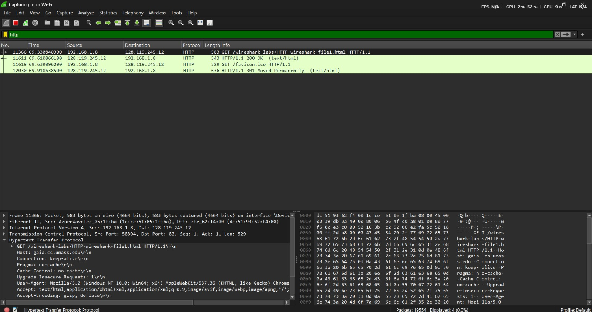
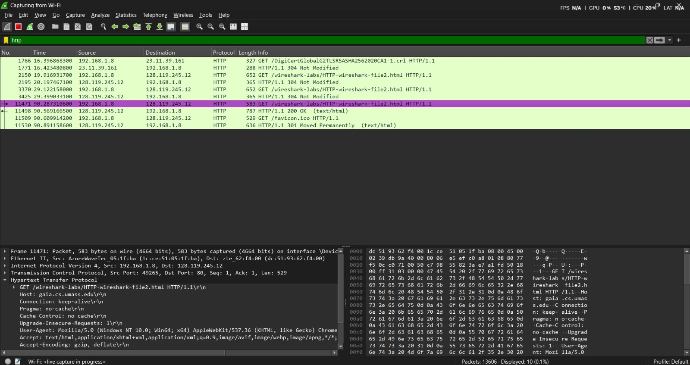
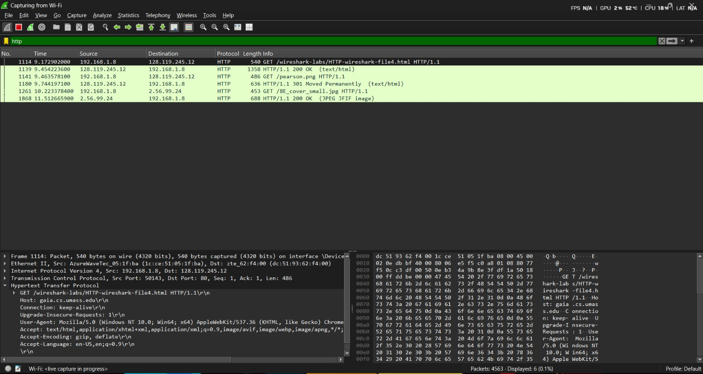
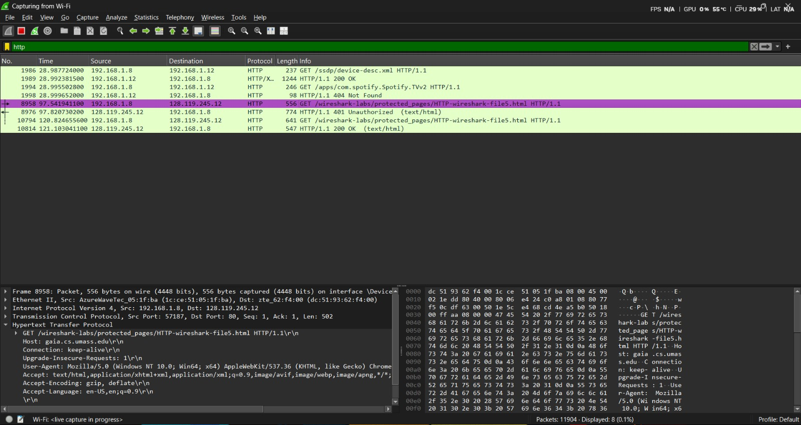

# Laporan Praktikum Jaringan Komputer - Modul 1

### Identitas Praktikan

| Item | Keterangan |
| :--- | :--- |
| **Nama** | Alif Luthfan Adeefa |
| **NIM** | 103072400163 |
| **Kelas** | IF-04-01 |

---

### 1. Tujuan Pembalajaran dan praktikum
Berdasarkan modul praktikum Jaringan Komputer Semester Genap 2025/2026, setelah menyelesaikan modul ini mahasiswa diharapkan mampu:

Menginvestigasi cara kerja protokol HTTP menggunakan Wireshark.
Mahasiswa memahami Conditional GET, dokumen panjang, embedded objects, dan autentikasi HTTP.

### 2. Dasar Teori

| Aspek | Deskripsi Singkat |
| :--- | :--- |
| **Basic GET/Response** | Interaksi dasar: klien meminta dokumen, server merespons dengan status code (misal: 200 OK). |
| **Conditional GET** | Mekanisme caching dengan header `If-Modified-Since`; server merespons `304 Not Modified` jika tidak ada perubahan. |
| **HTTP & TCP** | Dokumen besar dipecah menjadi beberapa segmen TCP (`TCP segment of a reassembled PDU`). |
| **Embedded Objects** | Halaman HTML dengan gambar/objek lain memicu *multiple* HTTP GET requests. |
| **HTTP Authentication** | Kredensial dikirim via header `Authorization: Basic` (Base64 encoded). |

---

### 3. Langkah Kerja & Prosedur

### 3.1 Ringkasan Prosedur per Skenario
Praktikum dilakukan dengan mengakses beberapa URL target sesuai skenario berikut:

| Skenario | URL Target | Langkah Kunci | Output yang Diharapkan |
| :--- | :--- | :--- | :--- |
| **Basic GET** | `.../file1.html` | Clear cache → Capture → Akses URL → Stop. | Paket GET + Response 200 OK. |
| **Conditional GET** | `.../file2.html` | Akses 2x (refresh) → Analisis header kedua. | Header `If-Modified-Since` + Status 304. |
| **Long Document** | `.../file3.html` | Akses dokumen besar (~4500 byte). | `[TCP segment of a reassembled PDU]`. |
| **Embedded Objects** | `.../file4.html` | Akses halaman dengan 2 gambar. | Multiple GET requests (HTML + gambar). |
| **Authentication** | `.../file5.html` | Login dengan kredensial yang ditentukan. | Header `Authorization: Basic`. |

### 3.2 Kredensial Autentikasi
Untuk skenario autentikasi, digunakan parameter login sebagai berikut:

* **Username**: `wireshark-students`
* **Password**: `network`
* **Encoding**: Base64
* **Header Format**: `Authorization: Basic <encoded_string>`

---

### 4. Hasil dan Pembahasan

### 4.1 Basic HTTP GET/Response

| Field | Nilai pada Request | Nilai pada Response |
| :--- | :--- | :--- |
| **Method / Status** | `GET` | `200 OK` |
| **Host / Server** | `gaia.cs.umass.edu` | `Apache/2.4.41` |
| **Content-Type** | `text/html, application/xhtml+xml` | `text/html; charset=ISO-8859-1` |

---

### 4.2 HTTP Conditional GET

| Percobaan | Header Khusus | Status Code | Keterangan |
| :--- | :--- | :--- | :--- |
| **Akses Pertama** | - | `200 OK` | Server mengirimkan konten secara penuh. |
| **Akses Kedua (Refresh)** | `If-Modified-Since` | `301 Moved Permanently` | Konten tidak berubah, browser menggunakan cache lokal. |

---

### 4.3 Retrieving Long Documents

-Respons HTTP tidak muat dalam satu paket TCP.

-Wireshark menampilkan keterangan [TCP segment of a reassembled PDU].

-Ini menunjukkan bahwa lapisan transportasi (TCP) memecah data besar menjadi segmen-segmen kecil sebelum dikirim.
---

### 4.4 HTML Documents dengan Embedded Objects

| Resource | Server | Method | Status |
| :--- | :--- | :--- | :--- |
| `file4.html` | `gaia.cs.umass.edu` | `GET` | `200 OK` |
| `pearson.png` | `gaia.cs.umass.edu` | `GET` | `200 OK` |
| `8E_cover_small.jpg` | `caite.cs.umass.edu` | `GET` | `200 OK` |

---

### 4.5 HTTP Authentication

| Tahap | Request | Response Server |
| :--- | :--- | :--- |
| **1 (tanpa auth)** | `GET /protected/...` | `401 Authorization Required` |
| **2 (dengan auth)** | `GET ... + Authorization: Basic ...` | `200 OK + konten halaman` |
---

### 5. Kesimpulan
1. Wireshark efektif untuk analisis HTTP yang dimana Memungkinkan inspeksi header, method, status code secara real-time

2. HTTP bersifat stateless + mendukung caching	Conditional GET (301) meningkatkan efisiensi tanpa ubah logika aplikasi

3. TCP menangani fragmentasi data besar	Developer tidak perlu kelola ukuran payload — TCP otomatis memecah

4. Embedded objects memicu multiple requests	Browser modern melakukan request paralel untuk percepat loading

5. HTTP Basic Auth tidak aman tanpa HTTPS	Base64 mudah didecode; selalu enkripsi traffic sensitif dengan TLS