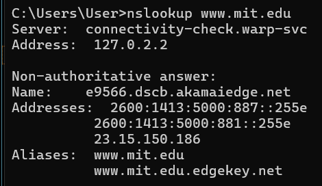
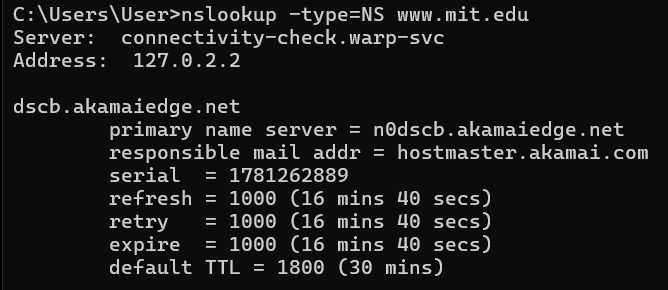
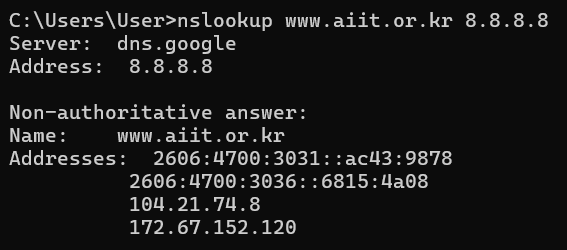
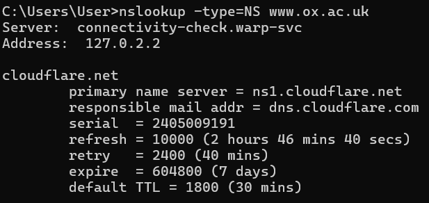

# Laporan Praktikum Jaringan Komputer: Domain Name System (DNS)

## 1. Capaian Pembelajaran

| No | Tujuan | Penjelasan Sederhana |
| :---: | :--- | :--- |
| **1** | Memahami konsep DNS | Mengerti bagaimana nama website diubah jadi angka IP |
| **2** | Menggunakan `nslookup` | Bisa pakai perintah `nslookup` untuk cek DNS |
| **3** | Mengenal jenis record DNS | Tahu bedanya A, NS, MX, CNAME, dan fungsinya |
| **4** | Memahami hierarki DNS | Mengerti alur dari DNS lokal → root → TLD → server asli |
| **5** | Mengelola cache DNS | Bisa lihat dan hapus cache DNS pakai `ipconfig` |

## 2. Dasar Teori

### 2.1 Apa Itu DNS?

| Pertanyaan | Jawaban |
| :--- | :--- |
| **Kepanjangan** | Domain Name System |
| **Fungsi Utama** | Mengubah nama domain (contoh: `google.com`) jadi alamat IP (contoh: `142.250.185.46`) |
| **Analogi Sederhana** | Seperti buku telepon: cari nama → dapat nomor |
| **Tanpa DNS** | Kita harus hafal angka IP tiap website |

### 2.3 Jenis-Jenis Record DNS

| Jenis Record | Fungsi | Contoh Hasil |
| :---: | :--- | :--- |
| **A** | Domain → IPv4 | `google.com` → `142.250.185.46` |
| **AAAA** | Domain → IPv6 | `google.com` → `2404:6800:4001:800::200e` |
| **NS** | Menunjukkan server DNS resmi domain | `google.com` → `ns1.google.com` |
| **MX** | Menunjukkan server email domain | `yahoo.com` → `mta7.am0.yahoodns.net` |
| **CNAME** | Nama alias / redirect domain | `www.mit.edu` → `mit.edu.edgekey.net` |
| **PTR** | IP → Domain (kebalikan A record) | `142.250.185.46` → `google.com` |

## 3. Langkah Kerja

### Ringkasan Semua Percobaan

| No | Percobaan | Perintah / URL | Yang Diamati |
| :---: | :--- | :--- | :--- |
| **1** | Query A Record | `nslookup www.mit.edu` | IP dari domain |
| **2** | Query NS Record | `nslookup -type=NS www.mit.edu` | Server DNS resmi domain |
| **3** | Query ke DNS tertentu | `nslookup www.aiit.or.kr 8.8.8.8` | Beda hasil pakai DNS Google |
| **4** | Query domain Asia | `nslookup www.nus.edu.sg` | IP server di Singapura |
| **5** | Query NS domain Eropa | `nslookup -type=NS www.ox.ac.uk` | Name server University of Oxford |
| **6** | Query MX Record | `nslookup -type=MX yahoo.com 8.8.8.8` | Server email Yahoo |
| **7** | Cek konfigurasi jaringan | `ipconfig /all` | Info IP, DNS, gateway laptop |
| **8** | Lihat cache DNS | `ipconfig /displaydns` | Daftar domain yang pernah diakses |
| **9** | Analisis DNS via Wireshark tanpa nslookup | Akses `www.ietf.org` + capture | Paket DNS query & response |
| **10** | Analisis nslookup via Wireshark | `nslookup www.mit.edu` + capture | Detail paket DNS dari tool |

## 4.1 Query A Record (Domain → IP)

| Informasi               | Nilai                            |
|-------------------------|----------------------------------|
| Domain yang dicek       | `www.mit.edu`                    |
| Hasil IP                | `23.15.150.186`                  |
| DNS Server yang dipakai | DNS lokal (dari `ipconfig`)      |
| Status jawaban          | Non-authoritative (dari cache)   |

## 4.2 Query NS Record (Siapa Server Resminya?)

| Informasi    | Nilai                        |
|--------------|------------------------------|
| Domain       | `www.mit.edu`                |
| Jenis Query  | NS (Name Server)             |
| Hasil        | Daftar server DNS resmi MIT  |
| Contoh       | `dscb.akamaiedge.net`        |

## 4.3 Query ke DNS Server Tertentu

| Parameter               | Nilai                                      |
|-------------------------|--------------------------------------------|
| Domain                  | `www.aiit.or.kr`                           |
| DNS Server yang dipakai | `8.8.8.8` (Google Public DNS)              |
| Hasil IP                | `172.67.152.120` , `104.21.74.8`           |

## 4.4 Query Alamat IP Server Web di Asia

| Domain            | Lokasi        | Hasil IP       | Keterangan                        |
|-------------------|---------------|----------------|-----------------------------------|
| `www.nus.edu.sg`  | Singapura, SG | `45.60.35.225` | National University of Singapore |

**Analisis:**

- Perintah `nslookup www.nus.edu.sg` digunakan untuk mengetahui alamat IP dari domain tersebut.

- Domain www.nus.edu.sg merupakan server web milik National University of Singapore (NUS) di Asia.

- Hasil query menampilkan satu atau lebih alamat IP yang terasosiasi dengan domain tersebut.

- Alamat IP inilah yang digunakan oleh client untuk mengakses server web tujuan.

- Query ini menunjukkan proses dasar resolusi DNS dari nama domain menjadi alamat IP.

## 4.5 Query DNS Otoritatif (NS Record)

**Analisis:**

- Perintah nslookup -type=NS www.ox.ac.uk digunakan untuk mengetahui server DNS otoritatif dari domain tersebut.

- Hasil query menampilkan daftar Name Server (NS) yang bertanggung jawab atas domain www.ox.ac.uk.

- Server DNS otoritatif adalah server yang memiliki informasi resmi terkait domain tersebut.

- Informasi ini penting untuk memahami bagaimana DNS mendistribusikan tanggung jawab pengelolaan domain.

- Domain tersebut merupakan milik University of Oxford di Eropa.