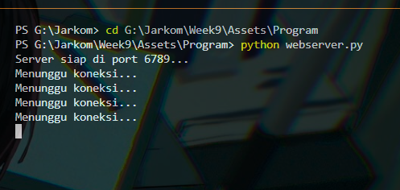
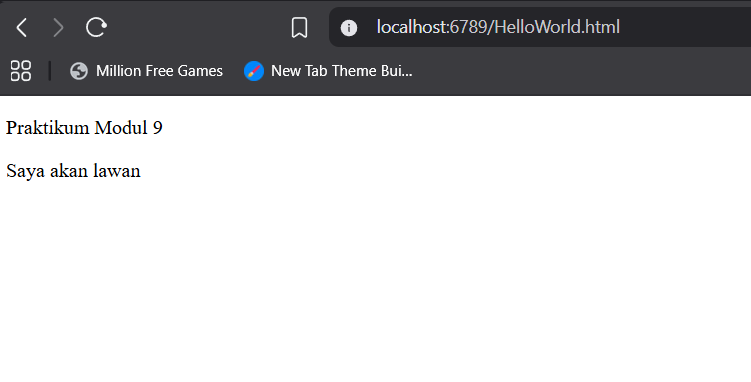
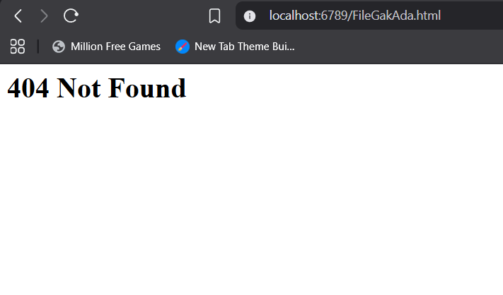
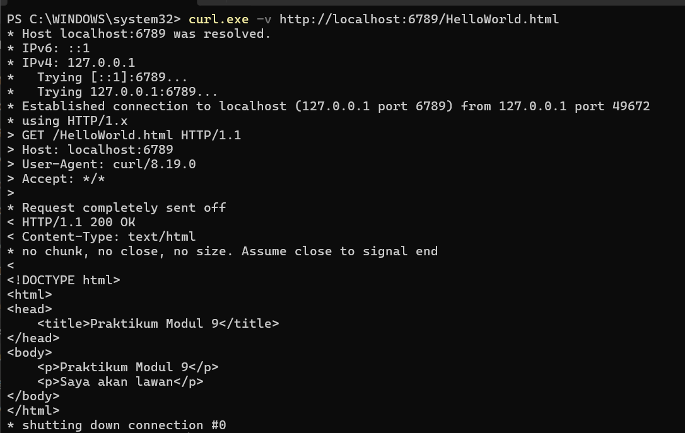
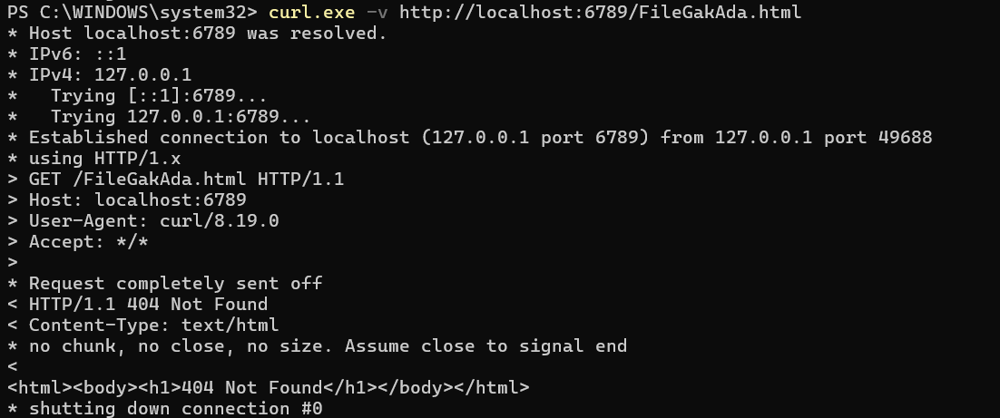

# Laporan Praktikum Jaringan Komputer - Modul 9
## Web Server Programming dengan Python Socket

### Identitas Praktikan
| Item | Keterangan |
|------|-----------|
| **Nama** | Alif Luthfan Adeefa |
| **NIM** | 103072400163 |
| **Kelas** | IF-04-01 |

---

## 9.1 Tujuan Praktikum
| No | Sasaran Pembelajaran | Deskripsi |
| --- | --- | --- |
| **1** | **Implementasi Socket** | Membuat web server sederhana menggunakan TCP socket programming. |
| **2** | **Pemahaman Protokol** | Memahami format HTTP request dan response secara mendalam. |
| **3** | **Manajemen File & Error** | Menangani request file dari klien dan mengimplementasikan error 404 Not Found. |
| **4** | **Validasi & Pengujian** | Menguji fungsionalitas server menggunakan browser dan command line. |

---

## 9.2 Kode Program Web Server

**File:** `webserver.py`

```python
from socket import *
import sys

serverSocket = socket(AF_INET, SOCK_STREAM)

serverPort = 6789
serverSocket.bind(('', serverPort))
serverSocket.listen(1)
print(f"Server siap di port {serverPort}...")

while True:
    print('Menunggu koneksi...')
    
    connectionSocket, addr = serverSocket.accept()
    
    try:
        message = connectionSocket.recv(1024).decode()
        filename = message.split()[1]
        f = open(filename[1:])
        outputdata = f.read()
        f.close()
        
        connectionSocket.send("HTTP/1.1 200 OK\r\n".encode())
        connectionSocket.send("Content-Type: text/html\r\n".encode())
        connectionSocket.send("\r\n".encode())
        
        for i in range(0, len(outputdata)):
            connectionSocket.send(outputdata[i].encode())
        connectionSocket.send("\r\n".encode())
        connectionSocket.close()
        
    except IOError:
        connectionSocket.send("HTTP/1.1 404 Not Found\r\n".encode())
        connectionSocket.send("Content-Type: text/html\r\n".encode())
        connectionSocket.send("\r\n".encode())
        connectionSocket.send("<html><body><h1>404 Not Found</h1></body></html>\r\n".encode())
        connectionSocket.close()

serverSocket.close()
sys.exit()
```

---

## 9.3 File HTML Testing

**File:** `helloworld.html`

```html
<!DOCTYPE html>
<html>
<head>
    <title>Praktikum Modul 9</title>
</head>
<body>
    <p>Praktikum Modul 9</p>
    <p>Saya akan lawan</p>
</body>
</html>
```

---

## 9.4 Hasil Praktikum

### 9.4.1 Struktur Folder dan File

**Lokasi File:**
```
Week9/
├── Assets/
│   └── Program/
│       ├── helloworld.html
│       └── webserver.py
└── Laporan.md
```

---

### 9.4.2 Server Running

**Command:**
```powershell
python webserver.py
```

**Hasil:**



Server berhasil dijalankan dengan:
- Menampilkan `"Server siap di port 6789..."`
- Menampilkan `"Menunggu koneksi..."` setiap kali siap menerima request baru

---

### 9.4.2 Source Code Web Server

**Kode di VS Code:**

Kode program web server dengan penjelasan:
- Baris 1-2: Import library socket dan sys
- Baris 4-9: Setup server socket dan binding ke port 6789
- Baris 11-13: Looping untuk accept koneksi client, cetak `"Menunggu koneksi..."`
- Baris 15-24: Parse HTTP request, baca file, kirim response 200 OK
- Baris 26-31: Handle error 404 Not Found jika file tidak ditemukan

---

### 9.4.3 Test via Browser - Success (200 OK)

**URL:** `http://localhost:6789/helloworld.html`

**Hasil:**



Halaman berhasil ditampilkan dengan:
- Teks "Praktikum Modul 9"
- Teks "Saya akan lawan"
- Status HTTP **200 OK**

---

### 9.4.4 Test via Browser - File Tidak Ada (404 Not Found)

**URL:** `http://localhost:6789/FileGakAda.html`

**Hasil:**



Server berhasil menangani error:
- Menampilkan **"404 Not Found"**
- Response HTTP **404** dikirim dengan benar
- HTML sederhana ditampilkan di browser

---

### 9.4.5 Test via curl - File Ada (200 OK)

**Command:**
```powershell
curl.exe -v http://localhost:6789/helloworld.html
```

**Output:**
```
* Established connection to localhost (127.0.0.1 port 6789)
> GET /helloworld.html HTTP/1.1
< HTTP/1.1 200 OK
< Content-Type: text/html

<!DOCTYPE html>
<html>
<head>
    <title>Praktikum Modul 9</title>
</head>
<body>
    <p>Praktikum Modul 9</p>
    <p>Saya akan lawan</p>
</body>
</html>
```



Response lengkap menunjukkan:
- Status code **200 OK**
- Content-Type: **text/html**
- Isi file HTML lengkap ter-parse dengan benar

---

### 9.4.6 Test via curl - File Tidak Ada (404 Not Found)

**Command:**
```powershell
curl.exe -v http://localhost:6789/FileGakAda.html
```

**Output:**
```
> GET /FileGakAda.html HTTP/1.1
< HTTP/1.1 404 Not Found
< Content-Type: text/html

<html><body><h1>404 Not Found</h1></body></html>
```



Response 404 terverifikasi via command line dengan:
- Status code: **404 Not Found**
- Content-Type: **text/html**
- Body: HTML dengan heading "404 Not Found"

---

## 9.5 Analisis HTTP Request/Response

### 9.5.1 HTTP Request (dari Browser)
```
GET /helloworld.html HTTP/1.1
Host: localhost:6789
User-Agent: curl/8.19.0
Accept: */*
```

### 9.5.2 HTTP Response (200 OK)
```
HTTP/1.1 200 OK
Content-Type: text/html

<!DOCTYPE html>
<html>
<head>
    <title>Praktikum Modul 9</title>
</head>
<body>
    <p>Praktikum Modul 9</p>
    <p>Saya akan lawan</p>
</body>
</html>
```

### 9.5.3 HTTP Response (404 Not Found)
```
HTTP/1.1 404 Not Found
Content-Type: text/html

<html><body><h1>404 Not Found</h1></body></html>
```

---

## 9.6 Penjelasan Kode

### 9.6.1 Setup Server Socket
```python
serverSocket = socket(AF_INET, SOCK_STREAM)
serverPort = 6789
serverSocket.bind(('', serverPort))
serverSocket.listen(1)
print(f"Server siap di port {serverPort}...")
```
- Membuat socket TCP dengan `AF_INET` (IPv4) dan `SOCK_STREAM` (TCP)
- Bind ke port **6789** di semua network interface
- Server mulai listening untuk koneksi masuk
- Menampilkan pesan `"Server siap di port 6789..."` saat siap

### 9.6.2 Accept Koneksi Client
```python
while True:
    print('Menunggu koneksi...')
    connectionSocket, addr = serverSocket.accept()
```
- Looping tanpa batas untuk handle multiple requests
- Menampilkan `"Menunggu koneksi..."` setiap siklus
- `accept()` membuat socket khusus (`connectionSocket`) untuk setiap client
- `addr` berisi tuple (IP_client, port_client)

### 9.6.3 Parse HTTP Request
```python
try:
    message = connectionSocket.recv(1024).decode()
    filename = message.split()[1]
    f = open(filename[1:])
    outputdata = f.read()
    f.close()
```
- Terima HTTP request (max 1024 bytes) dan decode dari bytes ke string
- Split message dan ambil elemen kedua (filename dari URL)
- Hilangkan karakter "/" pertama dengan `filename[1:]`
- Baca isi file ke variabel `outputdata`

### 9.6.4 Kirim HTTP Response (200 OK)
```python
connectionSocket.send("HTTP/1.1 200 OK\r\n".encode())
connectionSocket.send("Content-Type: text/html\r\n".encode())
connectionSocket.send("\r\n".encode())

for i in range(0, len(outputdata)):
    connectionSocket.send(outputdata[i].encode())
connectionSocket.send("\r\n".encode())
connectionSocket.close()
```
- **Status line:** `HTTP/1.1 200 OK`
- **Header:** `Content-Type: text/html`
- **Blank line:** `\r\n` menandakan akhir headers
- **Body:** Kirim isi file karakter per karakter
- Tutup koneksi setelah selesai

### 9.6.5 Handle Error (404 Not Found)
```python
except IOError:
    connectionSocket.send("HTTP/1.1 404 Not Found\r\n".encode())
    connectionSocket.send("Content-Type: text/html\r\n".encode())
    connectionSocket.send("\r\n".encode())
    connectionSocket.send("<html><body><h1>404 Not Found</h1></body></html>\r\n".encode())
    connectionSocket.close()
```
- Jika file tidak ditemukan → throw `IOError`
- Kirim response **404 Not Found**
- Sertakan HTML sederhana dengan pesan error
- Tutup koneksi client

---

## 9.7 Kesimpulan

Berdasarkan praktikum yang telah dilakukan:

| No | Aspek | Deskripsi Hasil |
| :--- | :--- | :--- |
| **1** | **Implementasi Kode** | Web server berhasil dibuat menggunakan Python TCP socket programming dengan jumlah kode $\approx 35$ baris. |
| **2** | **Konektivitas & Port** | Server berjalan pada port `6789` dan dapat diakses melalui browser atau command line (`curl.exe`). |
| **3** | **HTTP Response** | Implementasi berhasil menampilkan status **200 OK** (file ditemukan) dan **404 Not Found** (file tidak ditemukan) disertai *Content-Type header*. |
| **4** | **Standar Protokol** | Response sesuai standar RFC 7230: *Status Line*, *Headers*, *Blank Line*, dan *Body*. |
| **5** | **Server Handling** | Menggunakan `accept()` untuk koneksi klien, `recv()` untuk request, *file handling*, dan `close()` untuk menutup koneksi. |
| **6** | **Error Handling** | Berhasil menangani kesalahan file tidak ditemukan menggunakan *try-except* (IOError). |
| **7** | **Pengujian (Testing)** | Pengujian komprehensif via browser & `curl.exe` berhasil untuk skenario file ada dan tidak ada. |
| **8** | **Struktur Berkas** | File HTML dan skrip Python server ditempatkan dalam direktori yang sama dan terorganisir dengan baik. |

---